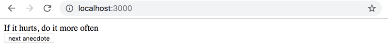
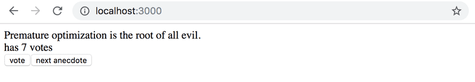
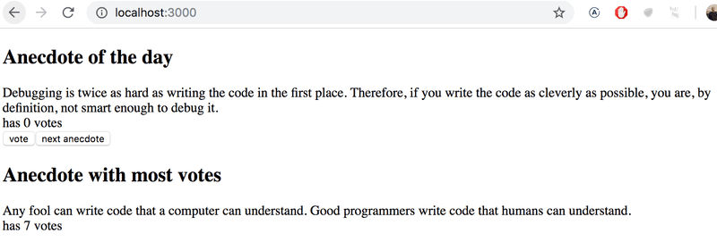

# Anecdotes

## 1.12*: anecdotes, paso 1

El mundo de la ingeniería de software está lleno de anécdotas que destilan verdades atemporales de nuestro campo en breves frases.

Expande la siguiente aplicación agregando un botón en el que se pueda hacer clic para mostrar una [anécdota](http://www.comp.nus.edu.sg/~damithch/pages/SE-quotes.htm) aleatoria del campo de la ingeniería de software:

```jsx

import { useState } from 'react'

const App = () => {
  const anecdotes = [
    'If it hurts, do it more often.',
    'Adding manpower to a late software project makes it later!',
    'The first 90 percent of the code accounts for the first 10 percent of the development time...The remaining 10 percent of the code accounts for the other 90 percent of the development time.',
    'Any fool can write code that a computer can understand. Good programmers write code that humans can understand.',
    'Premature optimization is the root of all evil.',
    'Debugging is twice as hard as writing the code in the first place. Therefore, if you write the code as cleverly as possible, you are, by definition, not smart enough to debug it.',
    'Programming without an extremely heavy use of console.log is same as if a doctor would refuse to use x-rays or blood tests when diagnosing patients.',
    'The only way to go fast, is to go well.'
  ]

  const [selected, setSelected] = useState(0)

  return (
    <div>
      {anecdotes[selected]}
    </div>
  )
}

export default App
```

El contenido del archivo main.jsx es el mismo de los ejercicios anteriores.

Busca como generar números aleatorios en JavaScript, por ejemplo, en un buscador o en Mozilla Developer Network. Recuerda que puedes probar la generación de números aleatorios, por ejemplo, directamente en la consola de tu navegador.


## 1.13*: anecdotes, paso 2

Expande tu aplicación para que puedas votar por la anécdota mostrada.


>Nota: almacena los votos de cada anécdota en un array u objeto en el estado del componente. Recuerda que la forma correcta de actualizar el estado almacenado en estructuras de datos complejas como objetos y arrays es hacer una copia del estado.

Puedes crear una copia de un objeto de esta forma:

```js
const points = { 0: 1, 1: 3, 2: 4, 3: 2 }

const copy = { ...points }
// incrementa en uno el valor de la propiedad 2
copy[2] += 1copy
```

O una copia de un array de esta forma:

```js
const points = [1, 4, 6, 3]

const copy = [...points]
// incrementa en uno el valor de la posición 2
copy[2] += 1
```

El uso de un array podría ser la opción más sencilla en este caso. Buscar en internet te proporcionará muchos consejos sobre cómo crear un array lleno de ceros de la longitud deseada.

## 1.14*: anecdotes, paso 3

Ahora implementa la versión final de la aplicación que muestra la anécdota con el mayor número de votos


Si varias anécdotas empatan en el primer lugar, es suficiente con solo mostrar una de ellas.

Este fue el último ejercicio de esta parte del curso y es hora de enviar tu código a GitHub y marcar todos tus ejercicios terminados en el sistema de envío de ejercicios.

Este fue el último ejercicio de esta parte del curso y es hora de enviar tu código a GitHub y marcar todos tus ejercicios terminados en el [sistema de envío de ejercicios](https://studies.cs.helsinki.fi/stats/courses/fullstackopen).
