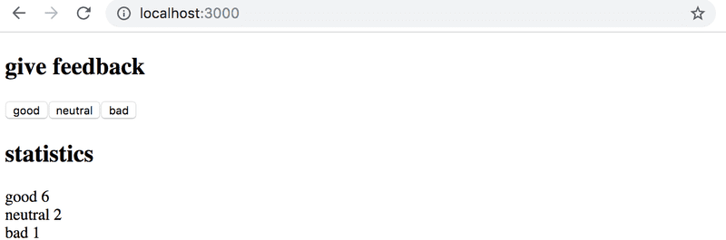
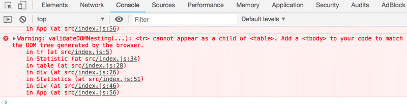

# unicafe

## 1.6: unicafe, paso 1

Como la mayoría de las empresas, Unicafe recopila comentarios de sus clientes. Tu tarea es implementar una aplicación web para recopilar comentarios de los clientes. Solo hay tres opciones para los comentarios: good (bueno), neutral y bad(malo).

La aplicación debe mostrar el número total de comentarios recopilados para cada categoría. Tu aplicación final podría verse así:



Ten en cuenta que tu aplicación debe funcionar solo durante una única sesión del navegador. Una vez que se actualice la página, los comentarios recopilados pueden desaparecer.

Te recomendamos usar la misma estructura usada en el material y en el anterior ejercicio. El archivo _main.jsx_ sería asi:

```jsx
import React from 'react'
import ReactDOM from 'react-dom/client'

import App from './App'

ReactDOM.createRoot(document.getElementById('root')).render(<App />)
```

Podrías usar el siguiente código como punto de partida para el archivo App.jsx:

```jsx
import { useState } from 'react'

const App = () => {
  // guarda los clics de cada botón en su propio estado
  const [good, setGood] = useState(0)
  const [neutral, setNeutral] = useState(0)
  const [bad, setBad] = useState(0)

  return (
    <div>
      code here
    </div>
  )
}

export default App

```

## 1.7: unicafe, paso 2

Amplía tu aplicación para que muestre más estadísticas sobre los comentarios recopilados: el número total de comentarios recopilados, la puntuación promedio (buena: 1, neutral: 0, mala: -1) y el porcentaje de comentarios positivos.


## 1.8: unicafe, paso 3

Refactoriza tu aplicación para que la visualización de las estadísticas se extraiga en su propio componente _Statistics_. El estado de la aplicación debe permanecer en el componente raíz _App_.

Recuerda que los componentes no deben definirse dentro de otros componentes:

```jsx
// un lugar adecuado para definir un componente
const Statistics = (props) => {
  // ...
}

const App = () => {
  const [good, setGood] = useState(0)
  const [neutral, setNeutral] = useState(0)
  const [bad, setBad] = useState(0)

  // no definas componentes adentro de otro componente
  const Statistics = (props) => {
    // ...
  }

  return (
    // ...
  )
}
```

## 1.9: unicafe paso 4

Cambia tu aplicación para mostrar estadísticas solo una vez que se hayan recopilado los comentarios.


## 1.10: unicafe paso 5

Continuemos refactorizando la aplicación. Extrae los siguiente dos componentes:

- **Button** para definir los botones utilizados para enviar comentarios
- **StatisticLine** para mostrar una única estadística, por ejemplo, la puntuación media.

Para ser claros: el componente **StatisticLine** siempre muestra una única estadística, lo que significa que la aplicación utiliza varios componentes para representar todas las estadísticas:

```jsx
const Statistics = (props) => {
  /// ...
  return(
    <div>
      <StatisticLine text="good" value ={...} />
      <StatisticLine text="neutral" value ={...} />
      <StatisticLine text="bad" value ={...} />
      // ...
    </div>
  )
}
```

El estado de la aplicación aún debe mantenerse en el componente raíz App.

## 1.11*: unicafe, paso 6

Muestra las estadísticas en una tabla HTML, de modo que tu aplicación se vea más o menos así:


Recuerda mantener la consola abierta en todo momento. Si ves esta advertencia en tu consola:


Entonces realiza las acciones necesarias para que la advertencia desaparezca. Intenta buscar en Google el mensaje de error si te quedas atascado.

>Una fuente típica de un error Unchecked runtime.lastError: Could not establish connection. Receiving end does not exist. es la extensión de Chrome. Intenta ir a chrome://extensions y deshabilitarlas una por una y luego actualizar la página de la aplicación React; el error debería desaparecer eventualmente.

¡Asegúrate de que a partir de ahora no veas ninguna advertencia en tu consola!
