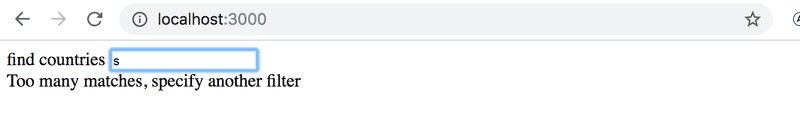
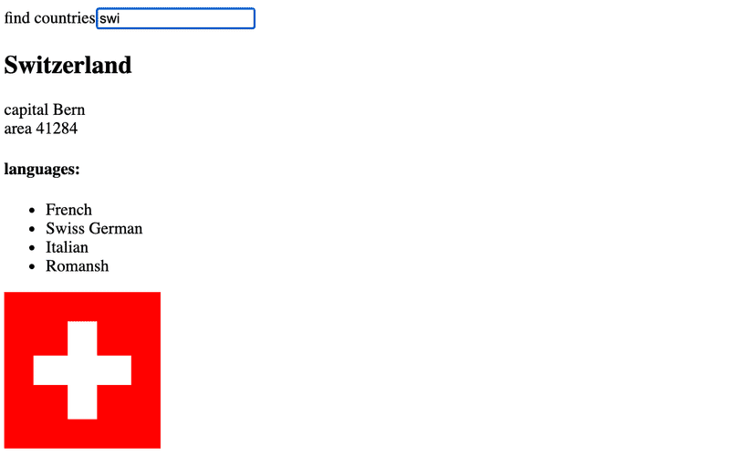

# Countries

## 2.18* Datos de países, paso 1

En [https://studies.cs.helsinki.fi/restcountries/](https://studies.cs.helsinki.fi/restcountries/) puedes encontrar un servicio que ofrece mucha información sobre diferentes países en un formato legible por máquinas a través de la API REST.

Crea una aplicación que te permita ver información de diferentes países.

La interfaz de usuario es muy simple.

- El país que se mostrará se encuentra escribiendo una consulta de búsqueda en el campo de búsqueda.

- Si hay demasiados países (más de 10) que coinciden con la consulta, se le pide al usuario que haga su consulta más específica:


- Si hay diez o menos países, pero más de uno, se muestran todos los países que coinciden con la consulta:


- Cuando solo hay un país que coincide con la consulta, se muestran los datos básicos del país (por ejemplo, capital y área), su bandera y los idiomas hablados:



>NB: Es suficiente que tu aplicación funcione para la mayoría de los países. Algunos países, como Sudán, pueden ser difíciles de admitir ya que el nombre del país es parte del nombre de otro país, Sudán del Sur. No es necesario que te preocupes por estos casos especiales.

## 2.19*: Datos de países, paso 2

Todavía hay mucho por hacer en esta parte, ¡así que no te atasques en este ejercicio!

Mejora la aplicación del ejercicio anterior, de modo que cuando se muestren los nombres de varios países en la página, haya un botón junto al nombre del país que, al presionarlo, muestra la vista de ese país:

adjuntar botones de muestra para cada característica del país
En este ejercicio, también es suficiente que tu aplicación funcione para la mayoría de los países. Se pueden ignorar los países cuyo nombre aparece en el nombre de otro país, como Sudán.

## 2.20*: Datos de países, paso 3

Agrega a la vista que muestra los datos de un solo país el informe meteorológico para la capital de ese país. Hay docenas de proveedores de datos meteorológicos. Una API sugerida es [https://openweathermap.org](https://openweathermap.org). Ten en cuenta que puede pasar algunos minutos hasta que una clave API generada sea válida.


Si usas **OpenWeatherMap**, [aquí](https://openweathermap.org/weather-conditions#Icon-list) tienes la descripción de cómo obtener iconos meteorológicos.

>NB: En algunos navegadores (como Firefox), la API elegida puede enviar una respuesta de error, lo que indica que no se admite el cifrado HTTPS, aunque la URL de la solicitud comience con `http://`. Este problema se puede solucionar completando el ejercicio con Chrome.

>NB: Necesitas una clave API para usar casi todos los servicios meteorológicos. ¡No guardes la clave API en GitHub! Ni codifiques la clave API en tu código fuente. En su lugar, **utiliza una variable de entorno para guardar la clave**.

Suponiendo que la clave API es 54l41n3n4v41m34rv0, cuando la aplicación se inicia de la siguiente manera:

```SHELL
export VITE_SOME_KEY=54l41n3n4v41m34rv0 && npm run dev // Para Linux/macOS Bash
($env:VITE_SOME_KEY="54l41n3n4v41m34rv0") -and (npm run dev) // Para Windows PowerShell
set "VITE_SOME_KEY=54l41n3n4v41m34rv0" && npm run dev // Para Windows cmd.exe
```

puedes acceder al valor de la clave desde el objeto `import.meta.env`:

```JS
const api_key = import.meta.env.VITE_SOME_KEY
// variable api_key ahora tiene el valor configurado
```

Ten en cuenta que deberás reiniciar el servidor para aplicar los cambios.

>Este fue el último ejercicio de esta parte del curso. Es hora de subir tu código a GitHub y marcar todos tus ejercicios terminados en el [sistema de envío de ejercicios](https://studies.cs.helsinki.fi/stats/courses/fullstackopen).
