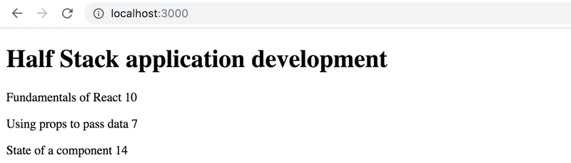
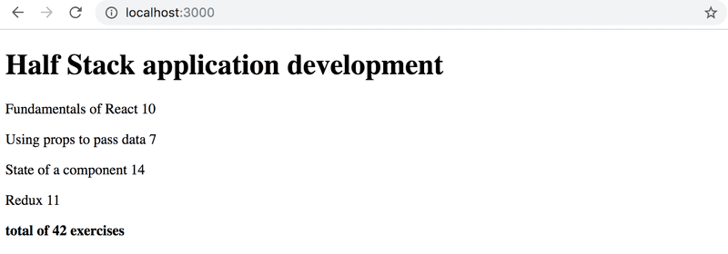
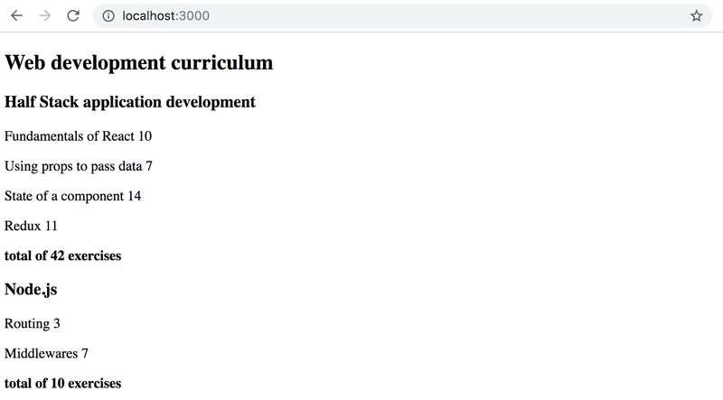

# Ejercicios

## 2.1: Información del curso paso 6

Terminemos el código para renderizar el contenido del curso de los ejercicios 1.1 - 1.5.

Cambiemos el componente App de la siguiente manera:

```jsx
const App = () => {
  const course = {
    id: 1,
    name: 'Half Stack application development',
    parts: [
      {
        name: 'Fundamentals of React',
        exercises: 10,
        id: 1
      },
      {
        name: 'Using props to pass data',
        exercises: 7,
        id: 2
      },
      {
        name: 'State of a component',
        exercises: 14,
        id: 3
      }
    ]
  }

  return <Course course={course} />
}

export default App
```

Define un componente responsable de formatear un solo curso llamado **Course**.

La estructura de componentes de la aplicación puede ser, por ejemplo, la siguiente:

```txt
App
  Course
    Header
    Content
      Part
      Part
      ...
```

Por lo tanto, el componente **Course** contiene los componentes definidos en la parte anterior, que son responsables de renderizar el nombre del curso y sus partes.

La página renderizada puede verse, por ejemplo, de la siguiente manera:


Aún no necesitas la suma de los ejercicios.

La aplicación debe funcionar independientemente del número de partes que tenga un curso, así que asegúrate de que la aplicación funcione si agregas o quitas partes de un curso.

¡Asegúrate de que la consola no muestre errores!

## 2.2: Información del curso paso 7

Muestra también la suma de los ejercicios del curso.


## 2.3*: Información del curso paso 8

Si aún no lo has hecho, calcula la suma de los ejercicios con el método de array reduce.

Consejo profesional: cuando tu código se ve así:

```js
const total = 
  parts.reduce((s, p) => someMagicHere)
```

y no funciona, vale la pena usar _console.log_, que requiere que la función de flecha se escriba en su forma más larga:

```js
const total = parts.reduce((s, p) => {
  console.log('what is happening', s, p)
  return someMagicHere
})
```

¿No funciona? : Utiliza tu motor de búsqueda para buscar cómo se utiliza **reduce** en un Array de Objetos.

## 2.4: Información del curso paso 9

Ampliemos nuestra aplicación para permitir un número arbitrario de cursos:

```jsx
const App = () => {
  const courses = [
    {
      name: 'Half Stack application development',
      id: 1,
      parts: [
        {
          name: 'Fundamentals of React',
          exercises: 10,
          id: 1
        },
        {
          name: 'Using props to pass data',
          exercises: 7,
          id: 2
        },
        {
          name: 'State of a component',
          exercises: 14,
          id: 3
        },
        {
          name: 'Redux',
          exercises: 11,
          id: 4
        }
      ]
    },
    {
      name: 'Node.js',
      id: 2,
      parts: [
        {
          name: 'Routing',
          exercises: 3,
          id: 1
        },
        {
          name: 'Middlewares',
          exercises: 7,
          id: 2
        }
      ]
    }
  ]

  return (
    <div>
      // ...
    </div>
  )
}
```

La aplicación puede, por ejemplo, verse así:


## 2.5: Módulo separado paso 10

Declara el componente **Course** como un módulo separado, que se importa en el componente **App**. Puedes incluir todos los subcomponentes del curso en el mismo módulo.
