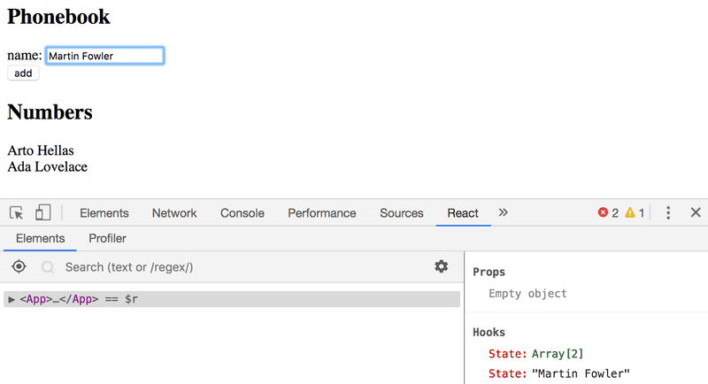
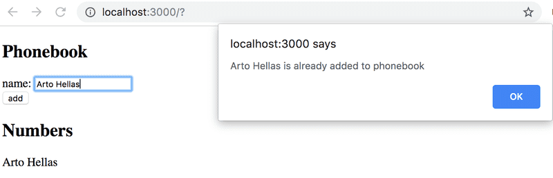
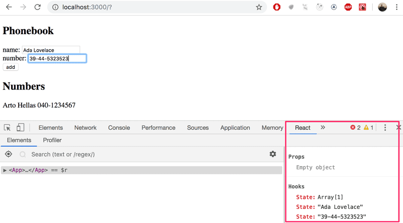
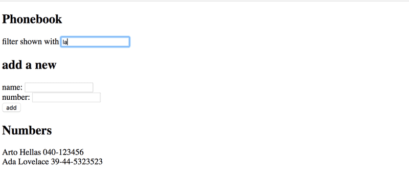
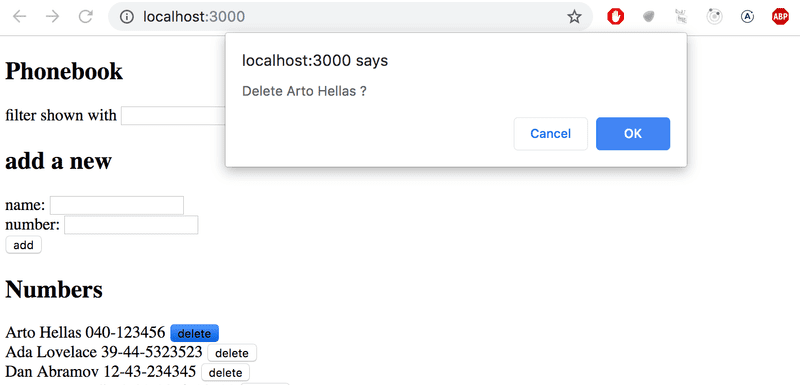
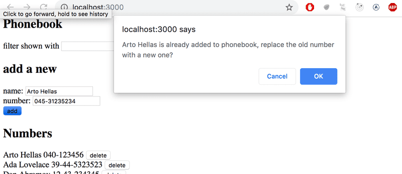

# Ejercicios 2.6.-2.10

Este es un nuevo ejercicio que comenzaremos a trabajar en una aplicación que se continuará desarrollando en los ejercicios posteriores. En conjuntos de ejercicios relacionados, es suficiente con presentar la versión final de tu aplicación. También puedes realizar un commit por separado después de haber terminado cada parte del conjunto de ejercicios, pero no es necesario hacerlo.

## 2.6: La Agenda Telefónica Paso 1

Creemos una agenda telefónica sencilla. En esta parte solo agregaremos nombres a la agenda.

Comencemos por implementar la adición de una persona a la agenda.

Puedes utilizar el siguiente código como punto de partida para el componente **App** de tu aplicación:

```jsx
import { useState } from 'react'

const App = () => {
  const [persons, setPersons] = useState([
    { name: 'Arto Hellas' }
  ])
  const [newName, setNewName] = useState('')

  return (
    <div>
      <h2>Phonebook</h2>
      <form>
        <div>
          name: <input />
        </div>
        <div>
          <button type="submit">add</button>
        </div>
      </form>
      <h2>Numbers</h2>
      ...
    </div>
  )
}

export default App
```

El estado de `newName` está destinado a controlar el elemento _input_ del formulario.

>A veces puede resultar útil representar el estado y otras variables como texto con fines de depuración. Puedes agregar temporalmente el siguiente elemento al componente renderizado:

  ```js
  <div>debug: {newName}</div>
  ```

También es importante poner lo que aprendimos en el capítulo depuración de aplicaciones React de la parte uno en buen uso. La extensión _React developer tools_ especialmente, es increíblemente útil para rastrear los cambios que ocurren en el estado de la aplicación.

Después de terminar este ejercicio, su aplicación debería verse así:


¡Ten en cuenta el uso de la extensión de herramientas de desarrollo React en la imagen de arriba!

>NB:
>
> - puedes utilizar el nombre de la persona como valor de la propiedad key
> - ¡recuerda evitar la acción predeterminada de enviar formularios HTML!

## 2.7: La Agenda Telefónica Paso 2

Evita que el usuario pueda agregar nombres que ya existen en la agenda telefónica. Los arrays de JavaScript tienen numerosos métodos adecuados para realizar esta tarea.

Emite una advertencia con el comando **alert** cuando se intente realizar una acción de este tipo:


>Sugerencia: cuando estés formando cadenas que contienen valores de variables, se recomienda utilizar una plantilla de cadena:

```js
`${newName} is already added to phonebook`
```

Si la variable `newName` tiene el valor _Arto Hellas_, la expresión de la plantilla de cadena regresa la cadena

```txt
`Arto Hellas is already added to phonebook`
```

Usar plantillas de cadenas es la opción más idiomática y el signo de un verdadero profesional de JavaScript.

## 2.8: La Agenda Telefónica Paso 3

Amplía tu aplicación permitiendo a los usuarios agregar números de teléfono a la agenda telefónica. Deberás agregar un segundo elemento input al formulario (junto con su propio controlador de eventos):

```jsx
<form>
  <div>name: <input /></div>
  <div>number: <input /></div>
  <div><button type="submit">add</button></div>
</form>
```

En este punto, la aplicación podría verse así. La imagen también muestra el estado de la aplicación con la ayuda de React developer tools:


## 2.9*: La Agenda Telefónica Paso 4

Implementa un _campo de búsqueda que pueda usarse para filtrar la lista de personas por nombre:


Puedes implementar el campo de búsqueda como un elemento _input_ que se coloca fuera del formulario HTML. La lógica de filtrado que se muestra en la imagen no distingue entre mayúsculas y minúsculas, lo que significa que el término de búsqueda "arto" también devuelve resultados que contienen "Arto" con una A mayúscula.

>NB: Cuando trabajes en una nueva funcionalidad, a menudo es útil "codificar" algunos datos ficticios en tu aplicación, por ejemplo

```jsx

const App = () => {
  const [persons, setPersons] = useState([
    { name: 'Arto Hellas', number: '040-123456', id: 1 },
    { name: 'Ada Lovelace', number: '39-44-5323523', id: 2 },
    { name: 'Dan Abramov', number: '12-43-234345', id: 3 },
    { name: 'Mary Poppendieck', number: '39-23-6423122', id: 4 }
  ])

  // ...
}
```

Esto evita tener que ingresar datos manualmente en tu aplicación para probar tu nueva funcionalidad.

## 2.10: La Agenda Telefónica Paso 5

Si has implementado tu aplicación en un solo componente, refactoriza extrayendo las partes adecuadas en nuevos componentes. Mantén el estado de la aplicación y todos los controladores de eventos en el componente raíz de App.

Es suficiente extraer tres componentes de la aplicación. Buenos candidatos para componentes separados son, por ejemplo, el **filtro de búsqueda**, el **formulario para agregar nuevas personas a la agenda telefónica**, un componente que **muestra a todas las personas de la agenda telefónica** y un componente que muestra los **detalles de una sola persona**.

El componente raíz de la aplicación podría verse similar a esto después de la refactorización. El componente raíz refactorizado a continuación solo representa los títulos y permite que los componentes extraídos se encarguen del resto.

```jsx
const App = () => {
  // ...

  return (
    <div>
      <h2>Phonebook</h2>

      <Filter ... />

      <h3>Add a new</h3>

      <PersonForm 
        ...
      />

      <h3>Numbers</h3>

      <Persons ... />
    </div>
  )
}
```

>NB: Es posible que tengas problemas en este ejercicio si defines tus componentes "en el lugar equivocado". Ahora sería un buen momento para recordar el capítulo no definir componentes dentro de los componentes de la última parte.

## 2.11: La Agenda Telefónica Paso 6

Continuamos con el desarrollo de la agenda telefónica. Almacena el estado inicial de la aplicación en el archivo **db.json**, que debe ubicarse en la raíz del proyecto.

```json
{
  "persons":[
    {
      "name": "Arto Hellas",
      "number": "040-123456",
      "id": 1
    },
    {
      "name": "Ada Lovelace",
      "number": "39-44-5323523",
      "id": 2
    },
    {
      "name": "Dan Abramov",
      "number": "12-43-234345",
      "id": 3
    },
    {
      "name": "Mary Poppendieck",
      "number": "39-23-6423122",
      "id": 4
    }
  ]
}
```

Inicia **json-server** en el puerto **3001** y asegúrate de que el servidor devuelve la lista de personas yendo a la dirección <http://localhost:3001/persons> en el navegador.

Si recibes el siguiente mensaje de error:

```shell
events.js:182
      throw er; // Unhandled 'error' event
      ^

Error: listen EADDRINUSE 0.0.0.0:3001
    at Object._errnoException (util.js:1019:11)
    at_exceptionWithHostPort (util.js:1041:20)copy
```

significa que el puerto 3001 ya está en uso por otra aplicación, por ejemplo en uso por un servidor json que ya se está ejecutando. Cierra la otra aplicación o cambia el puerto en caso de que no funcione.

Modifica la aplicación de modo que el estado inicial de los datos se obtenga del servidor mediante la librería **axios**. Completa la obtención de los datos con un **Effect hook**.

## 2.12: La Agenda Telefónica paso 7

Volvamos a nuestra aplicación de agenda telefónica.

Actualmente, los números que se agregan a la agenda telefónica no se guardan en un servidor backend. Soluciona esta situación.

## 2.13: La Agenda Telefónica paso 8

Extrae el código que maneja la comunicación con el backend en su propio módulo siguiendo el ejemplo mostrado anteriormente en esta parte del material del curso.

## 2.14: La Agenda Telefónica paso 9

Permite a los usuarios eliminar entradas de la agenda telefónica. La eliminación se puede hacer a través de un botón dedicado para cada persona en la lista de la agenda telefónica. Puedes confirmar la acción del usuario utilizando el método [**window.confirm**](https://developer.mozilla.org/es/docs/Web/API/Window/confirm):



El recurso asociado a una persona en el backend se puede eliminar haciendo una solicitud HTTP DELETE a la URL del recurso. Si estamos eliminando, por ejemplo, a una persona que tiene el id 2, tendríamos que hacer una solicitud HTTP DELETE a la URL localhost:3001/persons/2. No se envía ningún dato con la solicitud.

Puedes hacer una solicitud HTTP DELETE con la librería axios de la misma manera que hacemos todas las demás solicitudes.

>NB: No puedes usar el nombre delete para una variable porque es una palabra reservada en JavaScript. Por ejemplo, lo siguiente no es posible:

```js
// use some other name for variable!
const delete = (id) => {
  // ...
}
```

## 2.15*: La Agenda Telefónica paso 10

¿Por qué hay un asterisco en el ejercicio? Consulta [aquí](https://fullstackopen.com/es/part0/informacion_general#tomando-el-curso) para obtener la explicación.

Cambia la funcionalidad para que _si se agrega un número a un usuario que ya existe_, el nuevo número reemplace al antiguo. Se recomienda usar el método HTTP PUT para actualizar el número de teléfono.

Si la información de la persona ya está en la agenda telefónica, la aplicación puede pedirle al usuario que confirme la acción:

