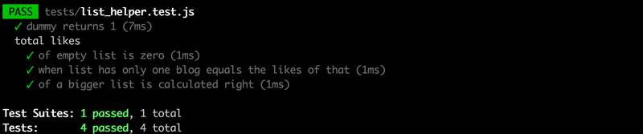

# Parte 4

>Nota: el material de este curso fue escrito con la version v20.11.0. Por favor asegúrate de que tu version de Node es al menos tan nueva como la version utilizada en el material (puedes chequear la version al ejecutar node -v en la linea de comandos).

En los ejercicios de esta parte, crearemos una aplicación de lista de blogs, que permite a los usuarios guardar información sobre blogs interesantes con los que se han encontrado en Internet. Para cada blog listado, guardaremos el autor, el título, la URL y la cantidad de votos positivos de los usuarios de la aplicación.

## 4.1 Lista de Blogs, paso 1

Imaginemos una situación en la que recibes un correo electrónico que contiene el siguiente cuerpo de la aplicación e instrucciones:

```js
const express = require('express')
const app = express()
const cors = require('cors')
const mongoose = require('mongoose')

const blogSchema = new mongoose.Schema({
  title: String,
  author: String,
  url: String,
  likes: Number
})

const Blog = mongoose.model('Blog', blogSchema)

const mongoUrl = 'mongodb://localhost/bloglist'
mongoose.connect(mongoUrl)

app.use(cors())
app.use(express.json())

app.get('/api/blogs', (request, response) => {
  Blog
    .find({})
    .then(blogs => {
      response.json(blogs)
    })
})

app.post('/api/blogs', (request, response) => {
  const blog = new Blog(request.body)

  blog
    .save()
    .then(result => {
      response.status(201).json(result)
    })
})

const PORT = 3003
app.listen(PORT, () => {
  console.log(`Server running on port ${PORT}`)
})
```

- Convierte la aplicación en un proyecto _npm funcional_.
- Para mantener tu desarrollo productivo, configura la aplicación para ejecutarse con **nodemon**.
- Puedes crear una nueva base de datos para tu aplicación con MongoDB Atlas o utilizar la misma base de datos de los ejercicios de la parte anterior.

Verifica que sea posible

- Agregar blogs a la lista con Postman o el cliente REST de VS Code y que
- la aplicación devuelva los blogs añadidos en el endpoint correcto.

## 4.2 Lista de Blogs, paso 2

Refactoriza la aplicación en _módulos separados_ como se mostró anteriormente en esta parte del material del curso.

>NB refactoriza tu aplicación en pequeños pasos y verifica que funcione después de cada cambio que realices.
Si intentas tomar un "atajo" refactorizando muchas cosas a la vez, entonces la ley de Murphy se activará y es
 casi seguro que algo se romperá en tu aplicación.
El "atajo" terminará tomando más tiempo que avanzar lenta y sistemáticamente.

Una de las mejores prácticas es hacer un _commit de tu código cada vez que está en un estado estable_. Esto facilita retroceder a una situación donde la aplicación aún funciona.

Si estás teniendo problemas con **content.body** siendo `undefined` sin razón aparente, asegúrate de no haber olvidado agregar `app.use(express.json())` cerca de la parte superior del archivo.

## Ejercicios 4.3 - 4.7

Creemos una colección de funciones auxiliares que estén destinadas a trabajar con las secciones describe de la lista de blogs.

- Crea las funciones en un archivo llamado `utils/list_helper.js`.
- Escribe tus pruebas en un archivo de prueba con el nombre apropiado en el directorio tests.

### 4.3: Funciones Auxiliares y Pruebas Unitarias, paso 1

Primero define una función **dummy** que reciba un array de publicaciones de blog como parámetro y siempre devuelva el valor 1.

El contenido del archivo `list_helper.js` en este punto debe ser el siguiente:

```js
const dummy = (blogs) => {
  // ...
}

module.exports = {
  dummy
}
```

Verifica que tu configuración de prueba funcione con la siguiente prueba:

```js
const { test, describe } = require('node:test')
const assert = require('node:assert')
const listHelper = require('../utils/list_helper')

test('dummy returns one', () => {
  const blogs = []

  const result = listHelper.dummy(blogs)
  assert.strictEqual(result, 1)
})
```

### 4.4: Funciones Auxiliares y Pruebas Unitarias, paso 2

Define una nueva función **totalLikes** que recibe una lista de publicaciones de blogs como parámetro.

La función devuelve _la suma total de likes en todas las publicaciones del blog_.

Escribe pruebas apropiadas para la función. Se recomienda poner las pruebas dentro de un bloque _describe_, para que la salida del informe de prueba se agrupe bien:



Definir datos de prueba para la función se puede hacer así:

```js
describe('total likes', () => {
  const listWithOneBlog = [
    {
      _id: '5a422aa71b54a676234d17f8',
      title: 'Go To Statement Considered Harmful',
      author: 'Edsger W. Dijkstra',
      url: 'https://homepages.cwi.nl/~storm/teaching/reader/Dijkstra68.pdf',
      likes: 5,
      __v: 0
    }
  ]

  test('when list has only one blog, equals the likes of that', () => {
    const result = listHelper.totalLikes(listWithOneBlog)
    assert.strictEqual(result, 5)
  })
})
```

Si definir tu propia lista de datos de prueba de blogs es demasiado trabajo, puedes usar la lista ya hecha [aquí](https://github.com/fullstack-hy2020/misc/blob/master/blogs_for_test.md).

Es probable que tengas problemas al escribir pruebas. Recuerda las cosas que aprendimos sobre depuración en la parte 3. Puedes imprimir cosas en la consola con `console.log` incluso durante la ejecución de la prueba.

### 4.5*: Funciones Auxiliares y Pruebas Unitarias, paso 3

Define una nueva función **favoriteBlog** que recibe una _lista de blogs_ como parámetro. La función descubre qué blog tiene más me gusta. Si hay muchos favoritos, basta con devolver uno de ellos.

El valor devuelto por la función podría tener el siguiente formato:

```js
{
  title: "Canonical string reduction",
  author: "Edsger W. Dijkstra",
  likes: 12
}
```

>NB cuando estás comparando objetos, el método [**`deepStrictEqual`**](https://nodejs.org/api/assert.html#assertdeepstrictequalactual-expected-message) es probablemente lo que debas usar, [`strictEqual`](https://nodejs.org/api/assert.html#assertstrictequalactual-expected-message) intenta verificar que los dos valores sean el mismo valor, y no solo que contengan las mismas propiedades. Para conocer las diferencias entre las distintas funciones del módulo _`assert`_, puedes consultar esta [respuesta Stack Overflow](https://stackoverflow.com/a/73937068/15291501).

Escribe las pruebas para este ejercicio dentro de un nuevo bloque _describe_. Haz lo mismo con los ejercicios restantes también.

### 4.6*: Funciones Auxiliares y Pruebas Unitarias, paso 4

Este y el siguiente ejercicio son un poco más desafiantes. No es necesario completar estos dos ejercicios para avanzar en el material del curso, por lo que puede ser una buena idea volver a estos una vez que haya terminado de leer el material de esta parte en su totalidad.

Se puede terminar este ejercicio sin el uso de librerías adicionales. Sin embargo, este ejercicio es una gran oportunidad para aprender a usar la librería **Lodash**.

Define una función llamada **mostBlogs** que reciba una lista de blogs como parámetro. La función devuelve el `author` que tiene la mayor cantidad de blogs. El valor de retorno también contiene el `número de blogs` que tiene el autor principal:

```js
{
  author: "Robert C. Martin",
  blogs: 3
}
```

Si hay muchos blogueros importantes, entonces es suficiente con devolver uno de ellos.

### 4.7*: Funciones Auxiliares y Pruebas Unitarias, paso 5

Define una función llamada **mostLikes** que reciba una _lista de blogs_ como parámetro. La función devuelve el `autor`, cuyas publicaciones de blog tienen la mayor cantidad de me gusta. El valor de retorno también contiene el `número total de likes` que el autor ha recibido:

```js
{
  author: "Edsger W. Dijkstra",
  likes: 17
}
```

Si hay muchos bloggers importantes, entonces es suficiente para mostrar cualquiera de ellos.

## Ejercicios 4.8.-4.12

>Advertencia: Si te encuentras utilizando los métodos `async/await` y `then` en el mismo código, es casi seguro que estás haciendo algo mal. Usa uno u otro y no mezcles los dos.

### 4.8: Pruebas de Lista de Blogs, paso 1

Utiliza la librería [**SuperTest**](https://www.npmjs.com/package/supertest) para escribir una prueba que realice
una solicitud HTTP GET a la URL `/api/blogs`.
Verifica que la aplicación de la lista de blogs devuelva la cantidad correcta de publicaciones de blog en formato JSON.

Una vez finalizada la prueba, refactoriza el controlador de ruta para usar la sintaxis `async/await` en lugar de _promesas_.

Ten en cuenta que tendrás que realizar cambios similares en el código a los que fueron hechos en el [material](https://fullstackopen.com/es/part4/probando_el_backend#entorno-de-prueba), como definir el entorno de prueba para que puedas escribir pruebas que usan una base de datos separada.

>NB: cuando estás escribiendo tus pruebas es mejor _no ejecutarlas todas_, solo ejecuta aquellas en las que estás trabajando.
Lee más sobre esto [aquí](https://fullstackopen.com/es/part4/probando_el_backend#ejecucion-de-pruebas-una-por-una).

### 4.9: Pruebas de Lista de Blogs, paso 2

Escribe una prueba que verifique que la propiedad de identificador único de las publicaciones del blog se llame `id`, de manera predeterminada, la base de datos nombra la propiedad `_id`.

Realiza los cambios necesarios en el código para que pase la prueba.
El método [`toJSON`](https://fullstackopen.com/es/part3/guardando_datos_en_mongo_db#backend-conectado-a-una-base-de-datos) discutido en la parte 3 es un lugar apropiado para definir el parámetro `id`.

### 4.10: Pruebas de Lista de Blogs, paso 3

Escribe una prueba que verifique que al realizar una solicitud HTTP POST a la URL `/api/blogs` se crea correctamente una nueva publicación de blog.
Como mínimo, verifica que el número total de blogs en el sistema se incrementa en uno.
También puedes verificar que el contenido de la publicación del blog se guarde correctamente en la base de datos.

Una vez finalizada la prueba, refactoriza la operación para usar `async/await` en lugar de promesas.

### 4.11*: Pruebas de Lista de Blogs, paso 4

Escribe una prueba que verifique que si la propiedad likes falta en la solicitud, tendrá el valor 0 por defecto.
No pruebes las otras propiedades de los blogs creados todavía.

Realiza los cambios necesarios en el código para que pase la prueba.

### 4.12*: Pruebas de lista de blogs, paso 5

Escribe una prueba relacionada con la creación de blogs nuevos a través del endpoint `/api/blogs`, que verifique que si faltan las propiedades `title` o `url` de los datos solicitados, el backend responde a la solicitud con el código de estado `400 Bad Request`.

Realiza los cambios necesarios en el código para que pase la prueba.

## Ejercicios 4.13.-4.14

## 4.13 Expansiones de la Lista de Blogs, paso 1

Implementa la funcionalidad para **eliminar un solo recurso** de publicación de blog.

Utiliza la sintaxis `async/await`. Sigue las convenciones de _RESTful_ al definir la API HTTP.

Implementa pruebas para esta funcionalidad.

## 4.14 Expansiones de Listas de Blogs, paso 2

Implementa la funcionalidad para **actualizar la información** de una publicación de blog individual.

Utiliza `async/await`.

La aplicación principalmente necesita _actualizar la cantidad de likes_ para una publicación de blog. Puedes implementar esta funcionalidad de la misma manera que implementamos actualizar notas en la parte 3.

Implementa pruebas para esta funcionalidad.
