# Parte 5

## Ejercicios 5.1.-5.4

Ahora crearemos un frontend para el backend de la lista de blogs que creamos en la última parte. Puedes usar esta aplicación de GitHub como base para tu solución. Debes conectar tu backend con un proxy como se muestra en la parte 3.

Es suficiente con enviar tu solución terminada. Puedes hacer un commit después de cada ejercicio, pero eso no es necesario.

Los primeros ejercicios revisan todo lo que hemos aprendido sobre React hasta ahora. Pueden ser un desafío, especialmente si tu backend está incompleto. Podría ser mejor usar el backend de la respuesta modelo de la parte 4.

Mientras realizas los ejercicios, recuerda todos los métodos de depuración de los que hemos hablado, especialmente mirar a la consola.

>Advertencia: Si notas que estás mezclando los comandos async/await y then, hay un 99.9% de probabilidades de que estés haciendo algo mal. Utiliza uno u otro, nunca ambos.

### 5.1: Frontend de la Lista de Blogs, paso 1

Clona la aplicación de GitHub con el comando:

```shell
git clone https://github.com/fullstack-hy2020/bloglist-frontend
```

Elimina la configuración de git de la aplicación clonada

```shell
cd bloglist-frontend   // ve al repositorio clonado
rm -rf .git
```

La aplicación se inicia de la forma habitual, pero primero debes instalar sus dependencias:

```shell
npm install
npm run devc
```

Implementa la funcionalidad de inicio de sesión en el frontend.

- El token devuelto con un inicio de sesión exitoso se guarda en el estado `user` de la aplicación.
- Si un usuario no ha iniciado sesión, solo se verá el formulario de inicio de sesión.

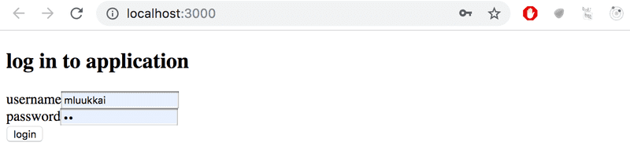

Si el usuario ha iniciado sesión, se muestra el nombre del usuario y una lista de blogs.

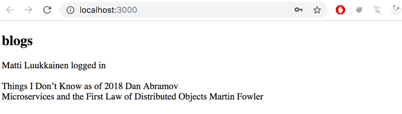

Los detalles del usuario que inició sesión no tienen que guardarse todavía en el _local storage_.

>NB Puedes implementar el renderizado condicional del formulario de inicio de sesión así, por ejemplo:

```jsx
  if (user === null) {
    return (
      <div>
        <h2>Log in to application</h2>
        <form>
          //...
        </form>
      </div>
    )
  }

  return (
    <div>
      <h2>blogs</h2>
      {blogs.map(blog =>
        <Blog key={blog.id} blog={blog} />
      )}
    </div>
  )

```

### 5.2: Frontend de la Lista de Blogs, paso 2

Haz que el inicio de sesión sea "permanente" mediante el use de _local storage_. También implementa una forma de cerrar sesión.

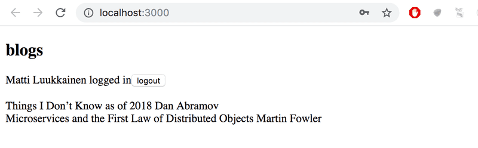
Asegúrate de que el navegador no recuerde los detalles del usuario después de cerrar la sesión.

### 5.3: Frontend de la Lista de Blogs, paso 3

Expande tu aplicación para permitir que un usuario que haya iniciado sesión agregue nuevos blogs:

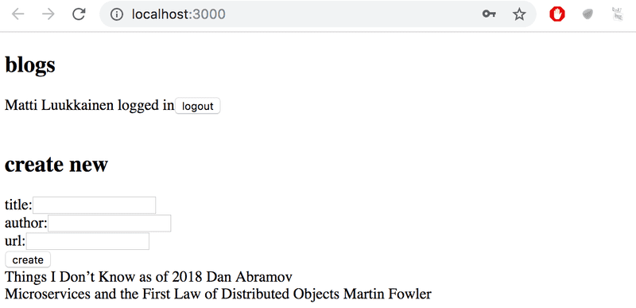

### 5.4: Frontend de la Lista de Blogs, paso 4

Implementa notificaciones que informen al usuario sobre operaciones exitosas y no exitosas en la parte superior de la página. Por ejemplo, cuando se agrega un nuevo blog, se puede mostrar la siguiente notificación:

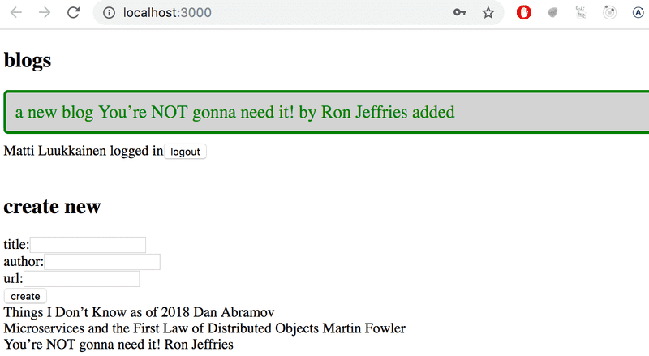
Un inicio de sesión fallido puede mostrar la siguiente notificación:

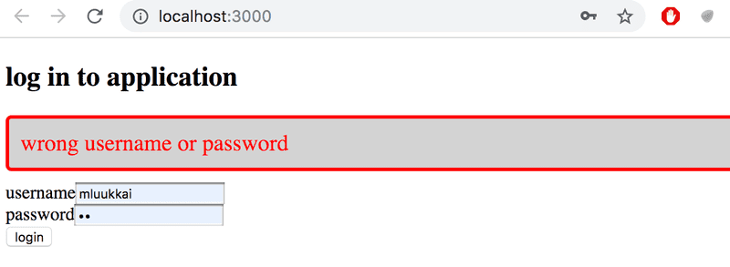
Las notificaciones deben estar visibles durante unos segundos. No es obligatorio agregar colores.

## Ejercicios 5.5.-5.11

### 5.5 Frontend de la Lista de Blogs, paso 5

Cambia el formulario para crear publicaciones de blog para que solo se muestre cuando sea apropiado. Utiliza una funcionalidad similar a la que se mostró anteriormente en [esta parte del material del curso](https://fullstackopen.com/es/part5/props_children_y_proptypes#mostrando-el-formulario-de-inicio-de-sesion-solo-cuando-sea-apropiado). Si lo deseas, puedes utilizar el componente **Togglable** definido en la parte 5.

Por defecto, el formulario no es visible

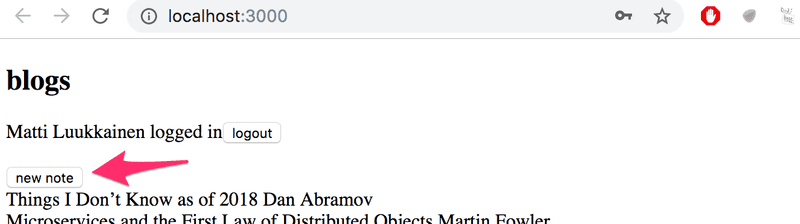
Se expande cuando se hace clic en el botón create new blog

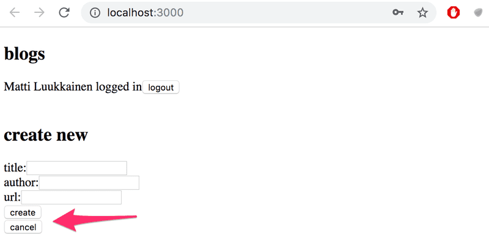
El formulario se esconde otra vez despues de crear un nuevo blog.

### 5.6 Frontend de la Lista de Blogs, paso 6

Separa el formulario para crear un nuevo blog en su propio componente (si aún no lo has hecho) y mueve todos los estados necesarios para crear un nuevo blog a ese componente.

El componente debe funcionar como el componente **NoteForm** del [material de esta parte](https://fullstackopen.com/es/part5/props_children_y_proptypes).

### 5.7 Frontend de la Lista de Blogs, paso 7

Agreguemos un botón a cada blog, que controle si se muestran o no todos los detalles sobre el blog.

Los detalles completos del blog se abren cuando se hace clic en el botón.

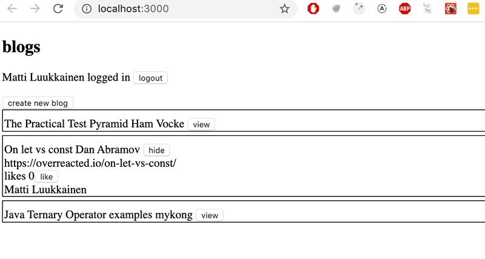
Y los detalles se ocultan cuando se vuelve a hacer clic en el botón.

En este punto, el botón `like` no necesita hacer nada.

La aplicación que se muestra en la imagen tiene un poco de CSS adicional para mejorar su apariencia.

Es fácil agregar estilos a la aplicación como se muestra en la parte 2 usando [estilos en línea](https://fullstackopen.com/es/part2/agregar_estilos_a_la_aplicacion_react#estilos-en-linea):

```jsx
const Blog = ({ blog }) => {
  const blogStyle = {
    paddingTop: 10,
    paddingLeft: 2,
    border: 'solid',
    borderWidth: 1,
    marginBottom: 5
  }

  return (
    <div style={blogStyle}>
      <div>
        {blog.title} {blog.author}
      </div>
      // ...
  </div>
)}
```

>NB: Aunque la funcionalidad implementada en esta parte es casi idéntica a la funcionalidad proporcionada por el componente **Togglable**, no se puede usar directamente para lograr el comportamiento deseado. La solución más fácil sería agregar un estado al componente **blog** que controle si todos los detalles están siendo mostrados o no.

### 5.8: Frontend de la Lista de Blogs, paso 8

Implementa la funcionalidad para el botón **like**. Los likes aumentan al hacer una solicitud `HTTP PUT` a la dirección única de la publicación del blog en el _backend_.

Dado que la operación de _backend_ reemplaza toda la publicación del blog, deberás enviar todos sus campos en el cuerpo de la solicitud. Si deseas agregar un `like` a la siguiente publicación de blog:

```js
{
  _id: "5a43fde2cbd20b12a2c34e91",
  user: {
    _id: "5a43e6b6c37f3d065eaaa581",
    username: "mluukkai",
    name: "Matti Luukkainen"
  },
  likes: 0,
  author: "Joel Spolsky",
  title: "The Joel Test: 12 Steps to Better Code",
  url: "<https://www.joelonsoftware.com/2000/08/09/the-joel-test-12-steps-to-better-code/>"
},
```

Deberías realizar una solicitud HTTP PUT a la dirección `/api/blogs/5a43fde2cbd20b12a2c34e91` con los siguientes datos de solicitud:

```js
{
  user: "5a43e6b6c37f3d065eaaa581",
  likes: 1,
  author: "Joel Spolsky",
  title: "The Joel Test: 12 Steps to Better Code",
  url: "<https://www.joelonsoftware.com/2000/08/09/the-joel-test-12-steps-to-better-code/>"
}
```

El _Backend_ también debe ser actualizado para manejar la referencia al usuario.

### 5.9: Frontend de la lista de Blogs, paso 9

Nos damos cuenta de que algo está mal. Cuando se da _"me gusta"_ a un blog en la app, el nombre del `usuario que añadió el blog` no se muestra en sus detalles:

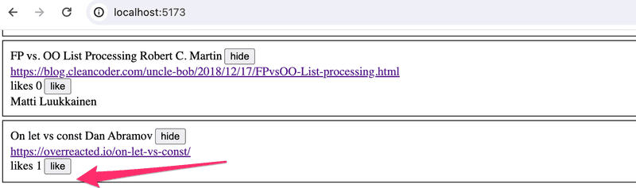
Cuando se recarga el navegador, la información de la persona se muestra. Esto no es aceptable, averigua dónde está el problema y realiza la corrección necesaria.

Por supuesto, es posible que ya hayas hecho todo correctamente y el problema no ocurra en tu código. En ese caso, puedes continuar.

### 5.10: Frontend de la Lista de Blogs, paso 10

Modifica la aplicación para enumerar las publicaciones de blog por el _número de likes_. La clasificación se puede hacer con el método de _array sort_.

### 5.11: Frontend de la Lista de Blogs, paso 11

Agrega un _nuevo botón para eliminar publicaciones de blog_. También implementa la lógica para eliminar publicaciones de blog en el _backend_.

Tu aplicación podría verse así:

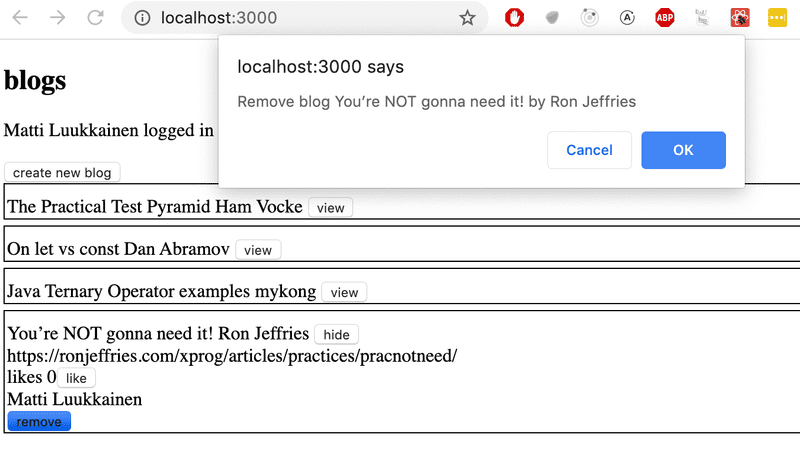
El cuadro de diálogo de confirmación para eliminar una publicación de blog es fácil de implementar con la función [`window.confirm`](https://developer.mozilla.org/es/docs/Web/API/Window/confirm).

Muestra el botón para eliminar una publicación de blog solo si la publicación de blog fue agregada por el usuario.

### 5.12: Frontend de la Lista de Blogs, paso 12

Define **PropTypes** para uno de los componentes de tu aplicación y agrega **ESlint al proyecto**. Define la configuración según tu preferencia. Corrige todos los errores del linter.

Vite ha instalado ESlint en el proyecto por defecto, así que todo lo que queda por hacer es definir tu configuración deseada en el archivo .eslintrc.cjs.

Podemos usar [Biome](https://biomejs.dev/guides/getting-started/) como herramienta de Analisis, Formateo y linter

```shell
pnpm add --save-dev --save-exact @biomejs/biome
pnpm biome init
pnpm biome migrate eslint --write
pnpm biome lint ./src 
```

## Ejercicios 5.13.-5.16

### 5.13: Pruebas de Listas de Blogs, paso 1

Realiza una prueba que verifique que el componente que muestra un blog muestre el título y el autor del blog, pero no muestre su URL o el número de likes por defecto

Agrega clases de CSS al componente para ayudar con las pruebas según sea necesario.

### 5.14: Pruebas de Listas de Blogs, paso 2

Realiza una prueba que verifique que la URL del blog y el número de likes se muestran cuando se hace clic en el botón que controla los detalles mostrados.

### 5.15: Pruebas de Listas de Blogs, paso 3

Realiza una prueba que garantice que si se hace clic dos veces en el botón like, se llama dos veces al controlador de eventos que el componente recibió como props.

### 5.16: Pruebas de Listas de Blogs, paso 4

Haz una prueba para el nuevo formulario de blog. La prueba debe verificar que el formulario llama al controlador de eventos que recibió como props con los detalles correctos cuando se crea un nuevo blog.
