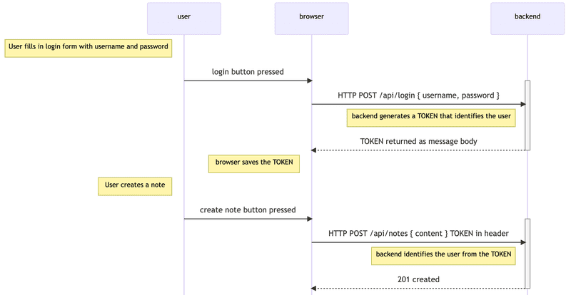

# Backend

## Parte 3

### A Node.js y Express

[Servidor simple](https://fullstackopen.com/es/part3/node_js_y_express)

- Express
- Web y Express
- nodemon
- REST
- Obteniendo un solo recurso
- Eliminar recursos
- Postman
- El cliente REST de Visual Studio Code
- El Cliente HTTP de WebStorm
- Recibiendo información
- Ejercicios 3.1-3.6.
- Acerca de los tipos de solicitudes HTTP
- Middleware
- Ejercicios 3.7.-3.8.

### B Despliegue de la aplicación a internet

[Despliegue de la aplicación](https://fullstackopen.com/es/part3/despliegue_de_la_aplicacion_a_internet)

- Política de mismo origen y CORS
- Aplicación a Internet
- Frontend production build
- Sirviendo archivos estáticos desde el backend
- La aplicación completa en Internet
- Optimizando el despliegue del frontend
- Proxy
- Ejercicios 3.9.-3.11.

### C Guardado de datos en MongoDB

[Guardado de datos en MongoDB](https://fullstackopen.com/es/part3/guardando_datos_en_mongo_db)

- Depuración en aplicaciones de Node
- MongoDB
- Schema
- Crear y guardar objetos
- Obteniendo objetos de la base de datos
- Ejercicio 3.12.
- Backend conectado a una base de datos
- Moviendo la configuración de la base de datos a su propio módulo
- Nota importante para usuarios de Fly.io
- Usando la base de datos en los controladores de ruta
- Verificación de la integración de frontend y backend
- Ejercicios 3.13.-3.14.
- Manejo de errores
- Mover el manejo de errores al middleware
- El orden de carga del middleware
- Otras operaciones
- Un verdadero juramento de desarrollador full stack
- Ejercicios 3.15.-3.18.

### D Validación y ESLint

[Validación y ESLint](https://fullstackopen.com/es/part3/validacion_y_es_lint)

- Desplegando el backend con base de datos a producción
- Ejercicios 3.19.-3.21.
- Lint
- Ejercicio 3.22.

## Parte 4

### [Estructura de la aplicación backend, introducción a las pruebas](https://fullstackopen.com/es/part4/estructura_de_la_aplicacion_backend_introduccion_a_las_pruebas)

- Estructura del proyecto
- Nota sobre las exportaciones
- Ejercicios 4.1.-4.2.
- Testing de aplicaciones Node
- Ejercicios 4.3.-4.7.

### [Probando el backend](https://fullstackopen.com/es/part4/probando_el_backend)

- Entorno de prueba - Pruebas de integración
- [supertest](https://github.com/visionmedia/supertest)
- Inicializando la base de datos antes de las pruebas
- Ejecución de pruebas una por una
- async/await
- async/await en el backend
- Más pruebas y refactorización del backend
- Manejo de errores y async/await
- Eliminando el try-catch
  - libreria [express-async-errors](https://github.com/davidbanham/express-async-errors)
  Permite eliminar el try/catch enviando todas las excepciones al middleware de que maneja los errores
- Optimización de la función beforeEach
- El juramento de un verdadero desarrollador full stack
  - El desarrollo full stack es extremadamente difícil , por eso usaré todos los medios posibles para hacerlo más fácil:
    - Mantendré la consola de desarrollador del navegador abierta todo el tiempo
    - Usaré la pestaña "Network" dentro de las herramientas de desarrollo del navegador, para asegurarme que el frontend y el backend se comuniquen como espero
    - Mantendré constantemente un ojo en el estado del servidor, para asegurarme de que los datos enviados allí por el frontend se guarden como espero
    - Vigilaré la base de datos para confirmar que los datos enviados por el backend se guarden en el formato correcto
    - Progresaré en pequeños pasos
    - Escribiré muchos `console.log` para asegurarme de que entiendo cómo se comporta el código y las pruebas; y para ayudarme a identificar problemas
    - Si mi código no funciona, no escribiré más código. En su lugar, comenzaré a eliminar código hasta que funcione o simplemente volveré a un estado en el que todo aún funciona
    - Si una prueba no pasa, me aseguraré de que la funcionalidad probada funcione correctamente en la aplicación
- Ejercicios 4.8.-4.12.
- Refactorizando pruebas
- Ejercicios 4.13.-4.14

### [Administración de usuarios](https://fullstackopen.com/es/part4/administracion_de_usuarios)

- Referencias entre colecciones
- Esquema de Mongoose para usuarios
- Creando usuarios
  - libreria [`bcrypt`](https://www.npmjs.com/package/bcrypt) bcrypt is a password-hashing function
- Creación de una nueva nota
- Populate

### [Autenticación basada en token](https://fullstackopen.com/es/part4/autenticacion_basada_en_token)

libreria [**jsonwebtoken**](https://github.com/auth0/node-jsonwebtoken)

- Limitar la creación de nuevas notas solo a usuarios registrados
- Solucion a problemas de la autenticación basada en Tokens
  - Caducidad del token
  - Comprobar en el servidor si el token es valido **server-side session**
    - Se utilizan bases de datos especificas [**redis**](https://redis.io/) para almacenar datos de sessión al ser mas rapidas a costa de ser menos flexibles
    - Se utilizan cookies para el paso de tokens entre cliente y servidor
- Notas finales
- Ejercicios 4.15.-4.23
