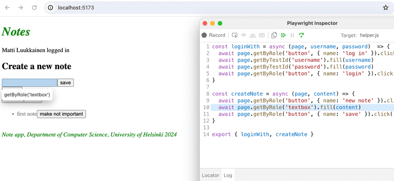

# Pruebas de extremo a extremo: Playwright

Hasta ahora, hemos probado el backend como un todo a nivel de API usando pruebas de integración, y probado algunos componentes frontend usando pruebas unitarias.

A continuación, veremos una forma de probar el sistema como un todo usando pruebas de Extremo a Extremo (End to End o E2E).

Podemos hacer pruebas E2E de una aplicación web usando un navegador y una librería de pruebas. Hay varias librerías disponibles, por ejemplo Selenium que se puede utilizar con casi cualquier navegador. Otra opción de navegador son los denominados headless browsers (navegadores sin cabeza), que son navegadores sin interfaz gráfica de usuario. Por ejemplo, Chrome se puede utilizar en modo sin cabeza.

Las pruebas E2E son potencialmente la categoría de pruebas más útil, porque prueban el sistema a través de la misma interfaz que usan los usuarios reales.

También tienen algunos inconvenientes. Configurar las pruebas E2E es más complicado que las pruebas unitarias o de integración. También tienden a ser bastante lentas y, con un sistema grande, su tiempo de ejecución puede ser de minutos, incluso horas. Esto es malo para el desarrollo, porque durante el desarrollo es beneficioso poder ejecutar pruebas con la mayor frecuencia posible en caso de sufrir regresiones de código.

Las pruebas E2E también pueden ser flaky (inestables). Algunas pruebas pueden pasar una vez y fallar en otra, incluso si el código no cambia en absoluto.

Quizás las dos librerías más fáciles para pruebas de extremo a extremo en este momento son Cypress y Playwright.

De las estadísticas en npmtrends.com vemos que Cypress, que dominó el mercado durante los últimos cinco años, sigue siendo claramente el número uno, pero Playwright está en un rápido ascenso:


Este curso ha estado usando Cypress durante años. Ahora Playwright es una nueva adición. Puedes elegir si completar la parte de pruebas E2E del curso con Cypress o Playwright. Los principios operativos de ambas librerías son muy similares, así que tu elección no es muy importante. Sin embargo, ahora Playwright es la librería E2E preferida para el curso.

Si tu elección es Playwright, por favor continúa. Si terminas usando Cypress, ve aquí.

## Playwright

[Playwright](https://playwright.dev/) es un recién llegado a las pruebas de extremo a extremo, que comenzó a explotar en popularidad hacia finales de 2023. Playwright está aproximadamente a la par con Cypress en términos de facilidad de uso. Las librerías son ligeramente diferentes en términos de cómo funcionan. Cypress es radicalmente diferente de la mayoría de las librerías de pruebas E2E, ya que las pruebas de Cypress se ejecutan completamente dentro del navegador. Las pruebas de Playwright, por otro lado, se ejecutan en el proceso de Node, que está conectado al navegador a través de interfaces de programación.

Se han escrito muchos blogs sobre comparaciones de librerías, por ejemplo, [este](https://www.lambdatest.com/blog/cypress-vs-playwright/) y [este](https://www.browserstack.com/guide/playwright-vs-cypress).

Es difícil decir qué librería es mejor. Una ventaja de Playwright es su soporte de navegadores; Playwright soporta Chrome, Firefox y navegadores basados en Webkit como Safari. Actualmente, Cypress incluye soporte para todos estos navegadores, aunque el soporte de Webkit es experimental y no soporta todas las funcionalidades de Cypress. Al momento de escribir (1.3.2024), mi preferencia personal se inclina ligeramente hacia Playwright.

Ahora exploremos Playwright.

## Inicializando pruebas

A diferencia de las pruebas de backend o las pruebas unitarias realizadas en el front-end de React, las pruebas de extremo a extremo no necesitan estar ubicadas en el mismo proyecto npm donde está el código. Hagamos un proyecto completamente separado para las pruebas E2E con el comando npm init. Luego instala Playwright ejecutando en el directorio del nuevo proyecto el comando:

```shell
npm init playwright@latest

```

El script de instalación hará algunas preguntas, responde de la siguiente manera:


Definamos un script npm para ejecutar pruebas e informes de pruebas en package.json:

```json
{
  // ...
  "scripts": {
    "test": "playwright test",
    "test:report": "playwright show-report"
  },
  // ...
}

```

Durante la instalación, lo siguiente se imprime en la consola:

```shell
And check out the following files:
  - ./tests/example.spec.js - Example end-to-end test
  - ./tests-examples/demo-todo-app.spec.js - Demo Todo App end-to-end tests
  - ./playwright.config.js - Playwright Test configuration
  
```
  
esto es, la ubicación de algunas pruebas de ejemplo para el proyecto que la instalación ha creado.

Ejecutemos algunas pruebas:

```shell
$ npm test

> notes-e2e@1.0.0 test
> playwright test

Running 6 tests using 5 workers
  6 passed (3.9s)

To open last HTML report run:

  npx playwright show-report
```

Las pruebas pasan. Un reporte más detallado puede abrirse tanto con el comando sugerido en la consola, como con el script de npm que acabamos de definir:

>npm run test:report

Las pruebas también pueden ejecutarse a través de la interfaz gráfica con el comando:

```shell
npm run test -- --ui
```

Las pruebas de muestra se ven así:

```js
const { test, expect } = require('@playwright/test');

test('has title', async ({ page }) => {
  await page.goto('<https://playwright.dev/>');

  // Expect a title "to contain" a substring.
  await expect(page).toHaveTitle(/Playwright/);
});

test('get started link', async ({ page }) => {
  await page.goto('<https://playwright.dev/>');

  // Click the get started link.
  await page.getByRole('link', { name: 'Get started' }).click();

  // Expects page to have a heading with the name of Installation.
  await expect(page.getByRole('heading', { name: 'Installation' })).toBeVisible();
});
```

La primera linea de las funciones test dicen que las pruebas están probando la pagina <https://playwright.dev/>.

## Probando nuestro propio código

Ahora eliminemos las pruebas de ejemplo y comencemos a probar nuestra propia aplicación.

Las pruebas de Playwright asumen que el sistema bajo prueba está en funcionamiento cuando se ejecutan las pruebas. A diferencia de, por ejemplo, las pruebas de integración de backend, las pruebas de Playwright no inician el sistema bajo prueba durante las pruebas.

Hagamos un script npm para el backend, que permitirá iniciarlo en modo de prueba, es decir, de modo que NODE_ENV obtenga el valor test.

```js
{
  // ...
  "scripts": {
    "start": "NODE_ENV=production node index.js",
    "dev": "NODE_ENV=development nodemon index.js",
    "build:ui": "rm -rf build && cd ../frontend/ && npm run build && cp -r build ../backend",
    "deploy": "fly deploy",
    "deploy:full": "npm run build:ui && npm run deploy",
    "logs:prod": "fly logs",
    "lint": "eslint .",
    "test": "NODE_ENV=test node --test",
    "start:test": "NODE_ENV=test node index.js"
  },
  // ...
}
```

Iniciemos el frontend y el backend, y creemos el primer archivo de prueba para la aplicación `tests/note_app.spec.js`:

```js
const { test, expect } = require('@playwright/test')

test('front page can be opened', async ({ page }) => {
  await page.goto('<http://localhost:5173>')

  const locator = await page.getByText('Notes')
  await expect(locator).toBeVisible()
  await expect(page.getByText('Note app, Department of Computer Science, University of Helsinki 2023')).toBeVisible()
})
```

Primero, la prueba abre la aplicación con el método [page.goto](https://playwright.dev/docs/writing-tests#navigation). Después de esto, utiliza el método page.[getByText](https://playwright.dev/docs/api/class-page#page-get-by-text) para obtener un [locator](https://playwright.dev/docs/locators) (localizador) que corresponde al elemento donde se encuentra el _texto_ Notes.

El método [toBeVisible](https://playwright.dev/docs/api/class-locatorassertions#locator-assertions-to-be-visible) asegura que el elemento correspondiente al localizador sea visible en la página.

La segunda comprobación se realiza sin usar la variable auxiliar.

Nos damos cuenta de que el año ha cambiado. Cambiemos la prueba de la siguiente manera:

```js
const { test, expect } = require('@playwright/test')

test('front page can be opened', async ({ page }) => {
  await page.goto('<http://localhost:5173>')

  const locator = await page.getByText('Notes')
  await expect(locator).toBeVisible()
  await expect(page.getByText('Note app, Department of Computer Science, University of Helsinki 2024')).toBeVisible()
})
```

Como se esperaba, la prueba falla. Playwright abre el informe de la prueba en el navegador y se hace evidente que Playwright ha realizado las pruebas con tres navegadores diferentes: Chrome, Firefox y Webkit, es decir, el motor de navegador utilizado por Safari:


Al hacer clic en el informe de uno de los navegadores, podemos ver un mensaje de error más detallado:


Generalmente, es por supuesto algo muy bueno que las pruebas se lleven a cabo con los tres motores de navegador más comúnmente utilizados, pero esto es lento, y al desarrollar las pruebas probablemente sea mejor realizarlas principalmente con solo un navegador. Puedes definir el motor de navegador a utilizar con el parámetro de línea de comando:

```shell
npm test -- --project chromium
```

Ahora corrijamos el año desactualizado en el código del frontend que causó el error.

Antes de continuar, agreguemos un bloque `describe` a las pruebas:

```js
const { test, describe, expect } = require('@playwright/test')

describe('Note app', () => {
  test('front page can be opened', async ({ page }) => {
    await page.goto('<http://localhost:5173>')

    const locator = await page.getByText('Notes')
    await expect(locator).toBeVisible()
    await expect(page.getByText('Note app, Department of Computer Science, University of Helsinki 2024')).toBeVisible()
  })
})
```

Antes de continuar, rompamos las pruebas una vez más. Notamos que la ejecución de las pruebas es bastante rápida cuando pasan, pero mucho más lenta si no pasan. La razón de esto es que la política de Playwright es esperar a que los elementos buscados estén [renderizados y listos para la acción](https://playwright.dev/docs/actionability). Si el elemento no se encuentra, se genera un TimeoutError y la prueba falla. Playwright espera por los elementos por defecto durante 5 o 30 segundos [dependiendo de las funciones utilizadas en la prueba](https://playwright.dev/docs/test-timeouts#introduction).

Al desarrollar pruebas, puede ser más prudente reducir el tiempo de espera a unos pocos segundos. Según la [documentación](https://playwright.dev/docs/test-timeouts), esto se puede hacer cambiando el archivo `playwright.config.js` de la siguiente manera:

```js
module.exports = defineConfig({
  timeout: 3000,
  fullyParallel: false,
  workers: 1,
  // ...
})
```

También hicimos dos cambios más en el archivo, y especificamos que todas las pruebas se [ejecuten una a una](https://playwright.dev/docs/test-parallel). Con la configuración predeterminada, la ejecución ocurre en paralelo, y dado que nuestras pruebas utilizan una base de datos, la ejecución en paralelo causa problemas.

## Escribiendo en un formulario

Escribamos una nueva prueba para intentar iniciar sesión en la aplicación. Supongamos que un usuario está guardado en la base de datos, con el nombre de usuario `mluukkai` y la contraseña `salainen`.

Comencemos abriendo el formulario de inicio de sesión.

```js
describe('Note app', () => {
  // ...

  test('login form can be opened', async ({ page }) => {
    await page.goto('<http://localhost:5173>')
    await page.getByRole('button', { name: 'log in' }).click()
  })
})

```

La prueba primero utiliza el método [page.getByRole](https://playwright.dev/docs/api/class-page#page-get-by-role) para encontrar el botón basado en su texto. El método devuelve el [Locator](https://playwright.dev/docs/api/class-locator) correspondiente al elemento Button. Presionar el botón se realiza utilizando el método [click](https://playwright.dev/docs/api/class-locator#locator-click) del Locator.

Al desarrollar pruebas, podrías usar el [modo UI](https://playwright.dev/docs/test-ui-mode) de Playwright, es decir, la versión de la interfaz de usuario. Comencemos las pruebas en modo UI de la siguiente manera:

```shell
npm test -- --ui
```

Ahora vemos que la prueba encuentra el botón


Después de hacer clic, aparecerá el formulario


Cuando se abre el formulario, la prueba debe buscar los campos de texto e introducir el nombre de usuario y la contraseña en ellos. Hagamos el primer intento utilizando el método [page.getByRole](https://playwright.dev/docs/api/class-page#page-get-by-role):

```js
describe('Note app', () => {
  // ...

  test('login form can be opened', async ({ page }) => {
    await page.goto('<http://localhost:5173>')

    await page.getByRole('button', { name: 'log in' }).click()
    await page.getByRole('textbox').fill('mluukkai')
  })
})
```

Esto resulta en un error:

```shell
Error: locator.fill: Error: strict mode violation: getByRole('textbox') resolved to 2 elements:

  1) <input value=""/> aka locator('div').filter({ hasText: /^username$/ }).getByRole('textbox')
  2) <input value="" type="password"/> aka locator('input[type="password"]')
```

El problema ahora es que `getByRole` encuentra dos campos de texto, y al llamar al método [fill](https://playwright.dev/docs/api/class-locator#locator-fill) falla, porque asume que solo se encontró un campo de texto. Una manera de solucionar el problema es utilizar los métodos [first](https://playwright.dev/docs/api/class-locator#locator-first) y [last]( https://playwright.dev/docs/api/class-locator#locator-last):

```js
describe('Note app', () => {
  // ...

  test('login form can be opened', async ({ page }) => {
    await page.goto('<http://localhost:5173>')

    await page.getByRole('button', { name: 'log in' }).click()
    await page.getByRole('textbox').first().fill('mluukkai')
    await page.getByRole('textbox').last().fill('salainen')
    await page.getByRole('button', { name: 'login' }).click()
  
    await expect(page.getByText('Matti Luukkainen logged in')).toBeVisible()
  })
})
```

Después de escribir en los campos de texto, la prueba presiona el botón login y verifica que la aplicación muestre la información del usuario que ha iniciado sesión en la pantalla.

Si hubiera más de dos campos de texto, utilizar los métodos `first` y `last` no sería suficiente. Una posibilidad sería usar el método [all](https://playwright.dev/docs/api/class-locator#locator-all), que convierte a los localizadores encontrados en un _array_ que puede ser indexado:

```js
describe('Note app', () => {
  // ...
  test('login form can be opened', async ({ page }) => {
    await page.goto('<http://localhost:5173>')

    await page.getByRole('button', { name: 'log in' }).click()
    const textboxes = await page.getByRole('textbox').all()
    await textboxes[0].fill('mluukkai')
    await textboxes[1].fill('salainen')

    await page.getByRole('button', { name: 'login' }).click()
  
    await expect(page.getByText('Matti Luukkainen logged in')).toBeVisible()
  })  
})
```

Ambas versiones de la prueba funcionan. Sin embargo, ambas son problemáticas en la medida en que si el formulario de registro cambia, las pruebas pueden fallar, ya que dependen de que los campos estén en la página en un cierto orden.

Una solución consiste en definir `atributos de id de prueba` (`data-testid`) únicos para los campos, y usarlos en las pruebas utilizando el método [getByTestId](https://playwright.dev/docs/api/class-page#page-get-by-test-id).

Ampliemos el formulario de inicio de sesión de la siguiente manera

```jsx
const LoginForm = ({ ... }) => {
  return (
    <div>
      <h2>Login</h2>
      <form onSubmit={handleSubmit}>
        <div>
          username
          <input
            data-testid='username'
            value={username}
            onChange={handleUsernameChange}
          />
        </div>
        <div>
          password
          <input
            data-testid='password'
            type="password"
            value={password}
            onChange={handlePasswordChange}
          />
        </div>
        <button type="submit">
          login
        </button>
      </form>
    </div>
  )
}
```

La prueba cambia de la siguiente manera:

```js
describe('Note app', () => {
  // ...

  test('login form can be opened', async ({ page }) => {
    await page.goto('<http://localhost:5173>')

    await page.getByRole('button', { name: 'log in' }).click()
    await page.getByTestId('username').fill('mluukkai')
    await page.getByTestId('password').fill('salainen')
  
    await page.getByRole('button', { name: 'login' }).click() 
  
    await expect(page.getByText('Matti Luukkainen logged in')).toBeVisible()
  })
})
```

Ten en cuenta que para que la prueba pase en esta etapa, es necesario que haya un usuario en la base de datos de test del backend con el nombre de usuario mluukkai y la contraseña salainen. ¡Crea un usuario si es necesario!

Dado que ambas pruebas comienzan de la misma manera, es decir, abriendo la página <http://localhost:5173>, se recomienda aislar la parte común en el bloque `beforeEach` que se ejecuta antes de cada prueba:

```js
const { test, describe, expect, beforeEach } = require('@playwright/test')

describe('Note app', () => {
  beforeEach(async ({ page }) => {
    await page.goto('<http://localhost:5173>')
  })

  test('front page can be opened', async ({ page }) => {
    const locator = await page.getByText('Notes')
    await expect(locator).toBeVisible()
    await expect(page.getByText('Note app, Department of Computer Science, University of Helsinki 2024')).toBeVisible()
  })

  test('login form can be opened', async ({ page }) => {
    await page.getByRole('button', { name: 'log in' }).click()
    await page.getByTestId('username').fill('mluukkai')
    await page.getByTestId('password').fill('salainen')
    await page.getByRole('button', { name: 'login' }).click()
    await expect(page.getByText('Matti Luukkainen logged in')).toBeVisible()
  })
})
```

## Probando el formulario para agregar notas

A continuación, agreguemos pruebas para probar la funcionalidad "new note":

```js
const { test, describe, expect, beforeEach } = require('@playwright/test')

describe('Note app', () => {
  // ...

  describe('when logged in', () => {
    beforeEach(async ({ page }) => {
      await page.getByRole('button', { name: 'log in' }).click()
      await page.getByTestId('username').fill('mluukkai')
      await page.getByTestId('password').fill('salainen')
      await page.getByRole('button', { name: 'login' }).click()
    })

    test('a new note can be created', async ({ page }) => {
      await page.getByRole('button', { name: 'new note' }).click()
      await page.getByRole('textbox').fill('a note created by playwright')
      await page.getByRole('button', { name: 'save' }).click()
      await expect(page.getByText('a note created by playwright')).toBeVisible()
    })
  })  
})
```

La prueba se ha definido en su propio bloque `describe`. Crear una nota requiere que el usuario haya iniciado sesión, lo cual es controlado en el bloque `beforeEach`.

La prueba confía en que al crear una nueva nota, la página contiene solo un campo de texto, por lo que lo busca así:

>page.getByRole('textbox')

Si la página tuviera más campos, la prueba se rompería. Debido a esto, sería mejor agregarle un `test-id` a los `inputs` del formulario y buscarlo basado en su `id`.

>Nota: la prueba solo pasara la primera vez. La razón de esto es que su aserción
> await expect(page.getByText('a note created by playwright')).toBeVisible()

causa problemas cuando la misma nota es creada en la aplicación más de una vez. El problema será resuelto en el próximo capitulo.

La estructura de las pruebas se ve así:

```js
const { test, describe, expect, beforeEach } = require('@playwright/test')

describe('Note app', () => {
  // ....

  test('user can log in', async ({ page }) => {
    await page.getByRole('button', { name: 'log in' }).click()
    await page.getByTestId('username').fill('mluukkai')
    await page.getByTestId('password').fill('salainen')
    await page.getByRole('button', { name: 'login' }).click()
    await expect(page.getByText('Matti Luukkainen logged in')).toBeVisible()
  })

  describe('when logged in', () => {
    beforeEach(async ({ page }) => {
      await page.getByRole('button', { name: 'log in' }).click()
      await page.getByTestId('username').fill('mluukkai')
      await page.getByTestId('password').fill('salainen')
      await page.getByRole('button', { name: 'login' }).click()
    })

    test('a new note can be created', async ({ page }) => {
      await page.getByRole('button', { name: 'new note' }).click()
      await page.getByRole('textbox').fill('a note created by playwright')
      await page.getByRole('button', { name: 'save' }).click()
      await expect(page.getByText('a note created by playwright')).toBeVisible()
    })
  })  
})
```

Dado que hemos evitado que las pruebas se ejecuten en paralelo, Playwright ejecuta las pruebas en el orden en que aparecen en el código de prueba. Es decir, primero se realiza la prueba _user can log in_, donde el usuario inicia sesión en la aplicación. Después de esto se ejecuta la prueba _a new note can be created_, que también realiza un inicio de sesión, en el bloque `beforeEach`. ¿Por qué se hace esto, no está ya el usuario conectado gracias a la prueba anterior? No, porque la ejecución de cada prueba comienza desde el "estado cero" del navegador, todos los cambios realizados en el estado del navegador por las pruebas anteriores se resetean.

## Controlando el estado de la base de datos

Si las pruebas necesitan poder modificar la base de datos del servidor, la situación inmediatamente se vuelve más complicada. Idealmente, la base de datos del servidor debería ser la misma cada vez que ejecutamos las pruebas, para que nuestras pruebas se puedan repetir de forma fiable y sencilla.

Al igual que con las pruebas unitarias y de integración, con las pruebas E2E es mejor vaciar la base de datos y posiblemente formatearla antes de ejecutar las pruebas. El desafío con las pruebas E2E es que no tienen acceso a la base de datos.

La solución es crear _endpoints de API en el backend_ para la prueba. Podemos vaciar la base de datos usando estos endpoints. Creemos un nuevo enrutador para las pruebas dentro del directorio `controllers`, en el archivo `testing.js`

```js
const testingRouter = require('express').Router()
const Note = require('../models/note')
const User = require('../models/user')

testingRouter.post('/reset', async (request, response) => {
  await Note.deleteMany({})
  await User.deleteMany({})

  response.status(204).end()
})

module.exports = testingRouter
```

y agrégalo al backend _"solo si la aplicación se ejecuta en modo de prueba"_:

```js
// ...

app.use('/api/login', loginRouter)
app.use('/api/users', usersRouter)
app.use('/api/notes', notesRouter)

if (process.env.NODE_ENV === 'test') {
  const testingRouter = require('./controllers/testing')
  app.use('/api/testing', testingRouter)
}

app.use(middleware.unknownEndpoint)
app.use(middleware.errorHandler)

module.exports = app
```

Después de los cambios, una solicitud POST HTTP al endpoint </api/testing/reset> vacía la base de datos. Asegúrate de que tu backend se esté ejecutándo en _modo de prueba_ iniciándolo con este comando (previamente configurado en el archivo package.json):

>npm run start:test

A continuación, cambiaremos el bloque `beforeEach` para que vacíe la base de datos del servidor antes de ejecutar las pruebas.

Actualmente no es posible agregar nuevos usuarios a través de la interfaz de usuario del frontend, por lo que tamiben agregamos un nuevo usuario al backend desde el bloque `beforeEach`.

```js
describe('Note app', () => {
  beforeEach(async ({ page, request }) => {
    await request.post('http:localhost:3001/api/testing/reset')
    await request.post('<http://localhost:3001/api/users>', {
      data: {
        name: 'Matti Luukkainen',
        username: 'mluukkai',
        password: 'salainen'
      }
    })

    await page.goto('http://localhost:5173')
  })
  
  test('front page can be opened',  () => {
    // ...
  })

  test('user can login', () => {
    // ...
  })

  describe('when logged in', () => {
    // ...
  })
})
```

Durante la inicialización, la prueba realiza solicitudes HTTP al backend con el método [post](https://playwright.dev/docs/api/class-apirequestcontext#api-request-context-post) del parámetro `request`.

Ahora la prueba siempre comienza desde el mismo estado, es decir, hay un usuario y no hay notas en la base de datos.

Hagamos una prueba que verifique que la "importancia de las notas pueda cambiarse".

Hay distintos enfoques para realizar esta prueba.

Primero buscamos una "nota" y hacemos "clic" en su botón con el texto "make not important". Después, comprobamos que la nota contiene el botón con el texto "make important".

```js
describe('Note app', () => {
  // ...

  describe('when logged in', () => {
    // ...

    describe('and a note exists', () => {
      beforeEach(async ({ page }) => {
        await page.getByRole('button', { name: 'new note' }).click()
        await page.getByRole('textbox').fill('another note by playwright')
        await page.getByRole('button', { name: 'save' }).click()
      })
  
      test('importance can be changed', async ({ page }) => {
        await page.getByRole('button', { name: 'make not important' }).click()
        await expect(page.getByText('make important')).toBeVisible()
      })
    })
  })
})
```

El primer comando busca el componente cuyo texto es "another note by playwright" y dentro de él al botón "make not important" y hace `clic` en él.

El segundo comando espera que el texto del mismo botón haya cambiado a "make important".

## Prueba de inicio de sesión fallida

Ahora hagamos una prueba que asegure que el intento de inicio de sesión falla si la contraseña es incorrecta.

La primera versión de la prueba se ve así:

```js
describe('Note app', () => {
  // ...

  test('login fails with wrong password', async ({ page }) => {
    await page.getByRole('button', { name: 'log in' }).click()
    await page.getByTestId('username').fill('mluukkai')
    await page.getByTestId('password').fill('wrong')
    await page.getByRole('button', { name: 'login' }).click()

    await expect(page.getByText('wrong credentials')).toBeVisible()
  })

  // ...
})
```

La prueba verifica con el método [page.getByText](https://playwright.dev/docs/api/class-page#page-get-by-text) que la aplicación muestra un mensaje de error.

La aplicación renderiza el mensaje de error en un elemento que contiene la clase CSS error:

```js
const Notification = ({ message }) => {
  if (message === null) {
    return null
  }

  return (
    <div className="error">
      {message}
    </div>
  )
}
```

Podríamos refinar la prueba para asegurar que el mensaje de error se muestre exactamente en el lugar correcto, es decir, en el elemento que contiene a la clase CSS error:

```js
  test('login fails with wrong password', async ({ page }) => {
  // ...

  const errorDiv = await page.locator('.error')
  await expect(errorDiv).toContainText('wrong credentials')
})
```

La prueba utiliza el método [page.locator](https://playwright.dev/docs/api/class-page#page-locator) para encontrar el componente que contiene la clase CSS error y lo almacena en una variable. La verificación del texto asociado con el componente se puede verificar con la aserción [toContainText](https://playwright.dev/docs/api/class-locatorassertions#locator-assertions-to-contain-text). Ten en cuenta que el [selector de clase CSS](https://developer.mozilla.org/es/docs/Web/CSS/Class_selectors) comienza con un punto, por lo que el selector de la clase error es .error.

Es posible probar los estilos CSS de la aplicación con el comparador [toHaveCSS](https://playwright.dev/docs/api/class-locatorassertions#locator-assertions-to-have-css). Podemos, por ejemplo, asegurarnos de que el color del mensaje de error sea rojo y que haya un borde alrededor de él:

```js
  test('login fails with wrong password', async ({ page }) => {
  // ...

    const errorDiv = await page.locator('.error')
    await expect(errorDiv).toContainText('wrong credentials')
    await expect(errorDiv).toHaveCSS('border-style', 'solid')
    await expect(errorDiv).toHaveCSS('color', 'rgb(255, 0, 0)')
})
```

En **Playwright** los colores deben definirse cómo códigos [rgb](https://rgbcolorcode.com/color/red).

Terminemos la prueba para que también asegure que la aplicación no renderiza al texto describiendo un inicio de de sesión exitoso _'Matti Luukkainen logged in'_:

```js
test('login fails with wrong password', async ({ page }) =>{
  await page.getByRole('button', { name: 'log in' }).click()
  await page.getByTestId('username').fill('mluukkai')
  await page.getByTestId('password').fill('wrong')
  await page.getByRole('button', { name: 'login' }).click()

  const errorDiv = await page.locator('.error')
  await expect(errorDiv).toContainText('wrong credentials')
  await expect(errorDiv).toHaveCSS('border-style', 'solid')
  await expect(errorDiv).toHaveCSS('color', 'rgb(255, 0, 0)')

  await expect(page.getByText('Matti Luukkainen logged in')).not.toBeVisible()
})
```

## Ejecutando pruebas una por una

Por defecto, Playwright siempre ejecuta todas las pruebas, y a medida que el número de pruebas aumenta, cada vez consume más tiempo. Al desarrollar una nueva prueba o depurar una rota, la prueba se puede definir en lugar de con el comando `test`, con el comando `test.only`, en cuyo caso Playwright ejecutará solo esa prueba:

```js
describe(() => {
  // esta es la única prueba ejecutada!
  test.only('login fails with wrong password', async ({ page }) => {
    // ...
  })

  // esta prueba es omitida...
  test('user can login with correct credentials', async ({ page }) => {
    // ...
  })

  // ...
})
```

Cuando la prueba esta lista, _only_ puede y **debe ser eliminado**.

Otra opción para ejecutar una sola prueba es utilizar un parámetro de la linea de comandos:

>npm test -- -g "login fails with wrong password"

## Funciones auxiliares para las pruebas

Las pruebas de nuestra aplicación actualmente se ven así:

```js
const { test, describe, expect, beforeEach } = require('@playwright/test')

describe('Note app', () => {
  // ...

  test('user can login with correct credentials', async ({ page }) => {
    await page.getByRole('button', { name: 'log in' }).click()
    await page.getByTestId('username').fill('mluukkai')
    await page.getByTestId('password').fill('salainen')
    await page.getByRole('button', { name: 'login' }).click()
    await expect(page.getByText('Matti Luukkainen logged in')).toBeVisible()
  })

  test('login fails with wrong password', async ({ page }) =>{
    // ...
  })

  describe('when logged in', () => {
    beforeEach(async ({ page, request }) => {
      await page.getByRole('button', { name: 'log in' }).click()
      await page.getByTestId('username').fill('mluukkai')
      await page.getByTestId('password').fill('salainen')
      await page.getByRole('button', { name: 'login' }).click()
    })

    test('a new note can be created', async ({ page }) => {
      // ...
    })
  
    // ...
  })  
})
```

Primero, se prueba la función de inicio de sesión. Después de esto, otro bloque describe contiene un conjunto de pruebas que asumen que el usuario ha iniciado sesión, el inicio de sesión se maneja dentro del bloque inicializador `beforeEach`.

Como ya se mencionó anteriormente, cada prueba se ejecuta comenzando desde el estado inicial (donde la base de datos se limpia y se crea un usuario allí), por lo tanto, aunque la prueba esté definida después de otra prueba en el código, ¡no comienza desde el mismo estado que han dejado las pruebas ejecutadas anteriormente en el código!

También vale la pena esforzarse por tener un código no repetitivo en las pruebas así que aislemos el código que maneja el inicio de sesión como una función auxiliar, que se coloca, por ejemplo, en el archivo `tests/helper.js`:

```js
const loginWith = async (page, username, password)  => {
  await page.getByRole('button', { name: 'log in' }).click()
  await page.getByTestId('username').fill(username)
  await page.getByTestId('password').fill(password)
  await page.getByRole('button', { name: 'login' }).click()
}

export { loginWith }
```

La prueba se vuelve mucho más simple y clara:

```js
const { loginWith } = require('./helper')

describe('Note app', () => {
  test('user can log in', async ({ page }) => {
    await loginWith(page, 'mluukkai', 'salainen')
    await expect(page.getByText('Matti Luukkainen logged in')).toBeVisible()
  })

  describe('when logged in', () => {
    beforeEach(async ({ page }) => {
      await loginWith(page, 'mluukkai', 'salainen')
    })

    test('a new note can be created', () => {
      // ...
    })
  })
  // ...
})
```

Playwright también ofrece una [solución](https://playwright.dev/docs/auth) donde el inicio de sesión se realiza una vez antes de las pruebas, y cada prueba comienza desde un estado en el que la aplicación ya ha iniciado sesión. Para que podamos aprovechar ese método, la inicialización de los datos de prueba de la aplicación debería hacerse de manera un poco diferente a la actual. En la solución actual, la base de datos se resetea antes de cada prueba, y debido a eso, iniciar sesión solo una vez antes de las pruebas es _imposible_. Para que podamos usar el inicio de sesión previo a la prueba proporcionado por Playwright, el usuario debería inicializarse solo una vez antes de las pruebas. Por simplicidad mantendremos nuestra solución actual.

El código repetitivo correspondiente también se aplica a la creación de una nueva nota. Para eso, hay una prueba que crea una nota usando un formulario. También en el bloque de inicialización beforeEach de la prueba que evalúa el cambio de importancia de la nota, se crea una nota utilizando el formulario:

```js
describe('Note app', function() {
  // ...

  describe('when logged in', () => {
    test('a new note can be created', async ({ page }) => {
      await page.getByRole('button', { name: 'new note' }).click()
      await page.getByRole('textbox').fill('a note created by playwright')
      await page.getByRole('button', { name: 'save' }).click()
      await expect(page.getByText('a note created by playwright')).toBeVisible()
    })
  
    describe('and a note exists', () => {
      beforeEach(async ({ page }) => {
        await page.getByRole('button', { name: 'new note' }).click()
        await page.getByRole('textbox').fill('another note by playwright')
        await page.getByRole('button', { name: 'save' }).click()
      })
  
      test('it can be made important', async ({ page }) => {
        // ...
      })
    })
  })
})
```

La creación de una nota también es aislada como una función auxiliar. El archivo `tests/helper.js` se expande de la siguiente manera:

```js
const loginWith = async (page, username, password)  => {
  await page.getByRole('button', { name: 'log in' }).click()
  await page.getByTestId('username').fill(username)
  await page.getByTestId('password').fill(password)
  await page.getByRole('button', { name: 'login' }).click()
}

const createNote = async (page, content) => {
  await page.getByRole('button', { name: 'new note' }).click()
  await page.getByRole('textbox').fill(content)
  await page.getByRole('button', { name: 'save' }).click()
}

export { loginWith, createNote }
```

Las pruebas se simplifican de la siguiente manera:

```js
describe('Note app', () => {
  // ...

  describe('when logged in', () => {
    beforeEach(async ({ page }) => {
      await loginWith(page, 'mluukkai', 'salainen')
    })

    test('a new note can be created', async ({ page }) => {
      await createNote(page, 'a note created by playwright', true)
      await expect(page.getByText('a note created by playwright')).toBeVisible()
    })

    describe('and a note exists', () => {
      beforeEach(async ({ page }) => {
        await createNote(page, 'another note by playwright', true)
      })
  
      test('importance can be changed', async ({ page }) => {
        await page.getByRole('button', { name: 'make not important' }).click()
        await expect(page.getByText('make important')).toBeVisible()
      })
    })
  })
})
```

Hay otra característica molesta en nuestras pruebas. Las direcciones del frontend <http://localhost:5173> y del backend <http://localhost:3001> están escritas en las pruebas. De estas, la dirección del backend en realidad es inútil, ya que hemos definido un proxy (en la configuración del frontend en Vite ), que redirige todas las solicitudes hechas por el frontend a la dirección  del backend <http://localhost:5173/api>:

```js
export default defineConfig({
  server: {
    proxy: {
      '/api': {
        target: '<http://localhost:3001>',
        changeOrigin: true,
      },
    }
  },
  // ...
})
```

Así que podemos reemplazar todas las direcciones en las pruebas de <http://localhost:3001/api/>... por <http://localhost:5173/api/>...

Ahora podemos definir la `baseUrl` para la aplicación en el archivo de configuración de las pruebas `playwright.config.js`:

```js
module.exports = defineConfig({
  // ...
  use: {
    baseURL: 'http://localhost:5173',
  },
  // ...
})
```

Todos los comandos en las pruebas que usan la URL de la aplicación, por ejemplo:

```js
await page.goto('http://localhost:5173')
await page.post('http://localhost:5173/api/tests/reset')
```

se pueden transformar en:

```js
await page.goto('/')
await page.post('/api/tests/reset')
```

## Revisión del cambio de importancia de la nota

Echemos un vistazo a la prueba que hicimos anteriormente, que verifica que es posible cambiar la importancia de una nota.

Cambiemos el bloque de inicialización de la prueba para que cree dos notas en lugar de una:

```js
describe('when logged in', () => {
  // ...
  describe('and several notes exists', () => {
    beforeEach(async ({ page }) => {
      await createNote(page, 'first note')
      await createNote(page, 'second note')
    })

    test('one of those can be made nonimportant', async ({ page }) => {
      const otherNoteElement = await page.getByText('first note')

      await otherNoteElement
        .getByRole('button', { name: 'make not important' }).click()
      await expect(otherNoteElement.getByText('make important')).toBeVisible()
    })
  })
})
```

La prueba primero busca el elemento correspondiente a la primera nota creada utilizando el método `page.getByText` y lo almacena en una variable. Después de esto, busca dentro del elemento un botón con el texto "make not important" y presiona el botón. Finalmente, la prueba verifica que el texto del botón haya cambiado a "make important".

La prueba también podría haberse escrito sin la variable auxiliar:

```js
test('one of those can be made nonimportant', async ({ page }) => {
  await page.getByText('first note')
    .getByRole('button', { name: 'make not important' }).click()

  await expect(page.getByText('first note').getByText('make important'))
    .toBeVisible()
})
```

Cambiemos el componente **Note** para que el texto de la nota se renderice dentro de un elemento _span_

```jsx
const Note = ({ note, toggleImportance }) => {
  const label = note.important
    ? 'make not important' : 'make important'

  return (
    <li className='note'>
      <span>{note.content}</span>
      <button onClick={toggleImportance}>{label}</button>
    </li>
  )
}
```

¡Las pruebas fallan! La razón del problema es que el comando `await page.getByText('second note')` ahora devuelve el elemento _span_ que contiene solo texto, y el botón está fuera de él.

Una forma de solucionar el problema es la siguiente:

```js
test('one of those can be made nonimportant', async ({ page }) => {
  const otherNoteText = await page.getByText('first note')
  const otherNoteElement = await otherNoteText.locator('..')

  await otherNoteElement.getByRole('button', { name: 'make not important' }).click()
  await expect(otherNoteElement.getByText('make important')).toBeVisible()
})
```

La primera línea ahora busca el elemento _span_ que contiene el texto asociado con la primera nota creada. En la segunda línea, se utiliza la función `locator` y se le da `..` como argumento, obtniendo el elemento padre. La función `locator` es muy flexible, y aprovechamos el hecho de que acepta como argumento no solo selectores CSS sino también selectores XPath. Sería posible expresar lo mismo con CSS, pero en este caso XPath proporciona la manera más sencilla de encontrar el padre de un elemento.

Por supuesto, la prueba también puede escribirse usando solo una variable auxiliar:

```js
test('one of those can be made nonimportant', async ({ page }) => {
  const secondNoteElement = await page.getByText('second note').locator('..')
  await secondNoteElement.getByRole('button', { name: 'make not important' }).click()
  await expect(secondNoteElement.getByText('make important')).toBeVisible()
})
```

Cambiemos la prueba para crear tres notas, la importancia se cambia en la segunda nota creada:

```js
describe('when logged in', () => {
  beforeEach(async ({ page }) => {
    await loginWith(page, 'mluukkai', 'salainen')
  })

  test('a new note can be created', async ({ page }) => {
    await createNote(page, 'a note created by playwright')
    await expect(page.getByText('a note created by playwright')).toBeVisible()
  })

  describe('and a note exists', () => {
    beforeEach(async ({ page }) => {
      await createNote(page, 'first note')
      await createNote(page, 'second note')
      await createNote(page, 'third note')
    })

    test('importance can be changed', async ({ page }) => {
      const otherNoteText = await page.getByText('second note')
      const otherdNoteElement = await otherNoteText.locator('..')
    
      await otherdNoteElement.getByRole('button', { name: 'make not important' }).click()
      await expect(otherdNoteElement.getByText('make important')).toBeVisible()
    })
  })
})
```

Por alguna razón, la prueba comienza a funcionar de manera poco confiable, a veces pasa y a veces no. Si la prueba te esta dando problemas, es hora de arremangarse y aprender cómo depurar pruebas.

## Ejecutando y depurando tus pruebas

Si, y cuando las pruebas no pasan o sospechas que la falla está en las pruebas en lugar de en el código, deberías ejecutar las pruebas en modo [debug](https://playwright.dev/docs/debug#run-in-debug-mode-1).

El siguiente comando ejecuta la prueba problemática en modo debug:

>npm test -- -g'importance can be changed' --debug

El inspector de Playwright muestra el progreso de las pruebas paso a paso. El botón de `flecha-punto` (F10) en la parte superior lleva las pruebas un paso más adelante. Los elementos encontrados por los localizadores y la interacción con el navegador se visualizan en el navegador:


Por defecto, el debug avanza a través de la prueba comando por comando. Si es una prueba compleja, puede ser bastante pesado avanzar hasta el punto de interés. Esto se puede evitar utilizando el comando `await page.pause()`:

```js
describe('Note app', () => {
  beforeEach(async ({ page, request }) => {
    // ...
  })

  describe('when logged in', () => {
    beforeEach(async ({ page }) => {
      // ...
    })

    describe('and several notes exists', () => {
      beforeEach(async ({ page }) => {
        await createNote(page, 'first note')
        await createNote(page, 'second note')
        await createNote(page, 'third note')
      })
  
      test('one of those can be made nonimportant', async ({ page }) => {
        await page.pause()
        const otherNoteText = await page.getByText('second note')
        const otherdNoteElement = await otherNoteText.locator('..')
      
        await otherdNoteElement.getByRole('button', { name: 'make not important' }).click()
        await expect(otherdNoteElement.getByText('make important')).toBeVisible()
      })
    })
  })
})
```

Ahora en la prueba puedes ir a `page.pause()` en un paso, presionando el símbolo de `flecha verde` en el inspector.

Cuando ejecutamos la prueba y saltamos al comando `page.pause()`, descubrimos un hecho interesante:


Parece que el navegador no renderiza todas las notas creadas en el bloque `beforeEach`. ¿Cuál es el problema?

La razón del problema es que cuando la prueba crea una nota, comienza a crear la siguiente incluso antes de que el servidor haya respondido, y la nota agregada se renderiza en la pantalla. Esto a su vez puede causar que algunas notas se pierdan (en la imagen, esto ocurrió con la segunda nota creada), ya que el navegador se vuelve a renderizar cuando el servidor responde, basado en el estado de las notas al inicio de esa operación de inserción.

El problema se puede resolver "ralentizando" las operaciones de inserción usando el comando [waitFor](https://playwright.dev/docs/api/class-locator#locator-wait-for) después de la inserción para esperar a que la nota insertada se renderice:

```js
const createNote = async (page, content) => {
  await page.getByRole('button', { name: 'new note' }).click()
  await page.getByRole('textbox').fill(content)
  await page.getByRole('button', { name: 'save' }).click()
  await page.getByText(content).waitFor()
}
```

En lugar de, o junto con el modo de depuración, ejecutar pruebas en modo UI puede ser útil. Como ya se mencionó, las pruebas se inician en modo UI de la siguiente manera:

>pnpm run test -- --ui

Casi lo mismo que el modo UI es el uso del [Trace Viewer](https://playwright.dev/docs/trace-viewer-intro) de Playwright. La idea es que se guarde un "rastro visual" de las pruebas, que se puede visualizar si es necesario después de que las pruebas se hayan completado. Un rastro se guarda ejecutando las pruebas de la siguiente manera:

>pnpm run test -- --trace on

Si es necesario, Trace puede verse con el comando

>pnpx playwright show report

o con el script pnpm que definimos `pnpm run test:report`

Trace se ve prácticamente igual que ejecutar pruebas en modo UI.

El modo UI y Trace Viewer también ofrecen la posibilidad de búsqueda asistida de _locators_. Esto se hace presionando el "doble círculo" en el lado izquierdo de la barra inferior, y luego haciendo clic en el elemento de la interfaz de usuario deseado. Playwright muestra el locator del elemento:


Playwright sugiere lo siguiente como el locator para la tercera nota

>page.locator('li').filter({ hasText: 'third note' }).getByRole('button')

El método [page.locator](https://playwright.dev/docs/api/class-page#page-locator) se llama con el argumento `li`, es decir, buscamos todos los elementos _li_ en la página, de los cuales hay un total de tres. Después de esto, utilizando el método [locator.filter](https://playwright.dev/docs/api/class-locator#locator-filter), nos centramos en el elemento _li_ que contiene el texto "third note" y el elemento del botón dentro de él se toma usando el método `locator.getByRole`.

El localizador generado por Playwright es algo diferente del localizador utilizado por nuestras pruebas, que era

>page.getByText('first note').locator('..').getByRole('button', { name: 'make not important' })

Cuál de los localizadores es mejor probablemente es cuestión de gustos.

Playwright también incluye un [generador de pruebas](https://playwright.dev/docs/codegen-intro) que hace posible "grabar" una prueba a través de la interfaz de usuario. El generador de pruebas se inicia con el comando:

>pnpx playwright codegen <http://localhost:5173/>

Cuando el modo `Record` está activado, el generador de pruebas "registra" la interacción del usuario en el inspector de Playwright, desde donde es posible copiar los _localizadores_ y _acciones_ a las pruebas:


En lugar de la línea de comandos, Playwright también se puede utilizar a través del [plugin de VS Code](https://marketplace.visualstudio.com/items?itemName=ms-playwright.playwright). El plugin ofrece muchas características convenientes, por ejemplo, el uso de breakpoints al depurar pruebas.

Para evitar situaciones problemáticas y aumentar la comprensión, definitivamente vale la pena explorar la [documentación](https://playwright.dev/docs/intro) de alta calidad de Playwright. Las secciones más importantes se enumeran a continuación:

- la sección sobre [locators](https://playwright.dev/docs/locators) ofrece buenos consejos para encontrar elementos en las pruebas
- la sección [actions](https://playwright.dev/docs/input) explica cómo es posible simular la interacción con el navegador en las pruebas
- la sección sobre [assertions](https://playwright.dev/docs/test-assertions) demuestra las diferentes aserciones que Playwright ofrece para las pruebas

Puedes encontrar más detalles en la [descripción de la API](https://playwright.dev/docs/api/class-playwright), siendo particularmente útiles:

- la [clase Page](https://playwright.dev/docs/api/class-page) que corresponde a la ventana del navegador de la aplicación bajo prueba, y
- la [clase Locator](https://playwright.dev/docs/api/class-locator) que corresponde a los elementos buscados en las pruebas.
